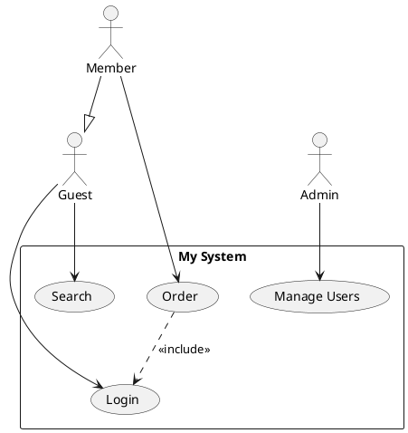
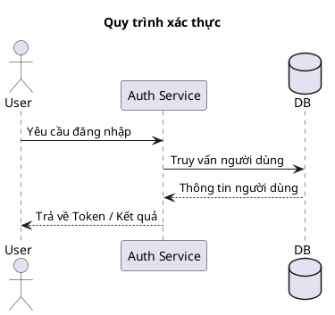

# StarUML MCP Server (Tài liệu Tiếng Việt)

[StarUML](https://staruml.io) là một công cụ mô hình hóa mạnh mẽ và tinh gọn cho phát triển phần mềm linh hoạt (agile). **StarUML MCP Server** cho phép bạn tạo sơ đồ hoặc sinh mã nguồn từ sơ đồ trong StarUML thông qua các câu lệnh (prompts) từ mô hình ngôn ngữ lớn (LLM).

## Thiết lập

Điều kiện tiên quyết:

- [StarUML](https://staruml.io/) phiên bản `v7.0.0` hoặc cao hơn
- [Node.js](https://nodejs.org/) phiên bản `v22` hoặc cao hơn

Thiết lập file cấu hình `claude_desktop_config.json` trong ứng dụng Claude Desktop như sau:

```json
{
  "mcpServers": {
    "staruml-mcp-server": {
      "command": "npx",
      "args": ["-y", "staruml-mcp-server"]
    }
  }
}
```

Bạn có thể sử dụng tùy chọn `--api-port=<port>` để thay đổi cổng chạy máy chủ API của StarUML.

## Các câu lệnh mẫu

- _"Tạo biểu đồ lớp cho cửa hàng sách trong StarUML"_
- _"Tạo biểu đồ tuần tự cho xác thực OAuth trong StarUML"_
- _"Sinh mã SQL DDL từ biểu đồ ERD hiện tại trong StarUML"_

## Các công cụ (Tools) hỗ trợ

- `generate_diagram`
- `get_current_diagram_info`
- `get_all_diagrams_info`
- `get_diagram_image_by_id`

## Phát triển

1. Sao chép (Clone) kho lưu trữ này.
2. Biên dịch dự án bằng lệnh: `npm run build`.
3. Cập nhật file cấu hình `claude_desktop_config.json` trong Claude Desktop như dưới đây.
4. Khởi động lại Claude Desktop.

```json
{
  "mcpServers": {
    "staruml-mcp-server": {
      "command": "node",
      "args": ["<đường-dẫn-đầy-đủ>/staruml-mcp-server/build/index.js"]
    }
  }
}
```

---

## Bộ nhập sơ đồ PlantUML (Tiện ích mở rộng / Extension)

Kho lưu trữ này cũng đi kèm một **tiện ích mở rộng cho StarUML** cho phép phân tích và nhập các loại sơ đồ từ cú pháp PlantUML, từ đó tự động sinh chúng thành các phần tử UML gốc bên trong StarUML.

### 📊 Sơ đồ hỗ trợ & Kế hoạch phát triển

| Loại sơ đồ | Trạng thái | Ghi chú |
|:---|:---|:---|
| **Use Case Diagram** (Biểu đồ Use Case) | ✅ Đã hỗ trợ | Phân phối dạng cột, bọc hệ thống |
| **Class Diagram** (Biểu đồ lớp) | ✅ Đã hỗ trợ | Bố cục dạng lưới, đầy đủ thuộc tính/phương thức & quan hệ |
| **Sequence Diagram** (Biểu đồ tuần tự) | ✅ Đã hỗ trợ | Sắp xếp theo trình tự thời gian, loại thông điệp, icon tác nhân |
| **Flowchart** (Sơ đồ dòng chảy / Lưu đồ) | ⏳ Sắp hỗ trợ | Lên kế hoạch cập nhật trong tương lai |
| **ER Diagram** (Biểu đồ ERD) | ⏳ Sắp hỗ trợ | Lên kế hoạch cập nhật trong tương lai |
| **Mindmap** (Sơ đồ tư duy) | ⏳ Sắp hỗ trợ | Lên kế hoạch cập nhật trong tương lai |
| **Requirement Diagram** (Biểu đồ yêu cầu) | ⏳ Sắp hỗ trợ | Lên kế hoạch cập nhật trong tương lai |
| **State Diagram** (Biểu đồ trạng thái) | ⏳ Sắp hỗ trợ | Lên kế hoạch cập nhật trong tương lai |

### ✨ Các tính năng nổi bật

- Phân tích cú pháp PlantUML cho biểu đồ Use Case, Class và Sequence.
- Thuật toán bố cục tự động: Bố cục lưới thông minh cho Class Diagram, căn cột ngang cho Use Case, và xếp chồng thông điệp theo trục thời gian đứng trên Sequence Diagram.
- Hỗ trợ đầy đủ các thuộc tính, phương thức, phạm vi truy cập (visibility) và bội số (multiplicities) trên Class Diagram.
- Hỗ trợ các quan hệ: `<<include>>`, `<<extend>>`, thừa kế (generalization), hiện thực hóa giao diện (interface realization), liên kết (association), thu nạp (aggregation) và hợp thành (composition).
- Hỗ trợ đầy đủ các loại lifeline (`actor`, `participant`, `boundary`, `control`, `entity`, `database`, `collections`) và đường thông điệp (`->`, `-->`, `->>`, `->*`, `->x`) trên Sequence Diagram.
- Tương thích tốt với **StarUML v7+**.

### 📦 Cài đặt

#### Cài đặt nhanh
- **Windows:** Nhấp đúp vào file `staruml-plantuml-importer\install.bat`
- **macOS / Linux:** Chạy lệnh `chmod +x staruml-plantuml-importer/install.sh && ./staruml-plantuml-importer/install.sh`

#### Cài đặt thủ công
Sao chép toàn bộ thư mục `staruml-plantuml-importer` vào thư mục extension của StarUML tùy thuộc hệ điều hành:

| Hệ điều hành | Đường dẫn thư mục cài đặt |
|:---|:---|
| Windows | `%APPDATA%\StarUML\extensions\user\staruml-plantuml-importer` |
| macOS | `~/Library/Application Support/StarUML/extensions/user/staruml-plantuml-importer` |
| Linux | `~/.config/StarUML/extensions/user/staruml-plantuml-importer` |

Sau khi sao chép xong, hãy khởi động lại StarUML.

### 🚀 Cách sử dụng

1. Mở ứng dụng StarUML.
2. Tạo một biểu đồ mới:
   - Sơ đồ Use Case: `Model` → `Add Diagram` → `Use Case Diagram`
   - Sơ đồ Class: `Model` → `Add Diagram` → `Class Diagram`
   - Sơ đồ Sequence: `Model` → `Add Diagram` → `Sequence Diagram`
3. Truy cập: **`Tools` → `PlantUML Importer` → Chọn lệnh nhập tương ứng**.
4. Dán đoạn mã PlantUML vào hộp thoại.
5. Nhấp **OK** — sơ đồ thực tế sẽ được tự động vẽ ra trên canvas!

### 📝 Cú pháp PlantUML được hỗ trợ

#### Ví dụ Biểu đồ Use Case



#### Ví dụ Biểu đồ Sequence



#### Các phần tử được hỗ trợ cụ thể

##### Phần tử Use Case & Class Diagram
| Phần tử | Cú pháp |
|:---|:---|
| Tác nhân (Actor) | `actor "Tên" as Alias` |
| Ca sử dụng (Use Case) | `usecase "Tên" as Alias` |
| Liên kết (Association) | `Actor --> UseCase` |
| Bao hàm (Include) | `UC1 ..> UC2 : <<include>>` |
| Mở rộng (Extend) | `UC1 ..> UC2 : <<extend>>` |
| Thừa kế / Khái quát hóa | `Child --|> Parent` |

##### Phần tử Sequence Diagram
| Phần tử | Cú pháp / Loại | Mô tả |
|:---|:---|:---|
| Actor | `actor ActorName` | Lifeline đại diện cho tác nhân, hiển thị dạng hình người |
| Participant | `participant PartName` | Lifeline hiển thị dạng hình chữ nhật thông thường |
| Database | `database DBName` | Lifeline đại diện cho cơ sở dữ liệu (hình trụ) |
| Sync Call | `A -> B : Thông điệp` | Cuộc gọi đồng bộ (đường nét liền, mũi tên đặc) |
| Async Call | `A ->> B : Thông điệp` | Cuộc gọi bất đồng bộ (đường nét liền, mũi tên hở) |
| Reply Message | `A --> B : Thông điệp` | Phản hồi (đường nét đứt, mũi tên hở) |
| Create | `A ->* B : Thông điệp` | Khởi tạo lifeline/đối tượng mới |
| Delete | `A ->x B : Thông điệp` | Hủy/xóa lifeline/đối tượng |
