# Bộ nhập sơ đồ PlantUML cho StarUML

[](https://github.com/TwotNguyenVN/staruml-plantuml-importer/releases)
[](https://staruml.io)
[](https://opensource.org/licenses/MIT)
[](https://github.com/TwotNguyenVN/staruml-plantuml-importer/stargazers)
[](https://github.com/TwotNguyenVN/staruml-plantuml-importer/releases)

🌍 **Ngôn ngữ:** [English](README.md) | [Tiếng Việt](README-VN.md)

Tiện ích mở rộng dành cho StarUML hỗ trợ phân tích và nhập các loại biểu đồ **Use Case, Class, Sequence, Activity và ER Diagrams** từ cú pháp **PlantUML**, từ đó tự động sinh chúng thành các phần tử UML gốc bên trong StarUML.

## 📊 Sơ đồ hỗ trợ & Kế hoạch phát triển

| Loại sơ đồ                                | Trạng thái    | Ghi chú                                                        |
| :---------------------------------------- | :------------ | :------------------------------------------------------------- |
| **Use Case Diagram** (Biểu đồ Use Case)   | ✅ Đã hỗ trợ  | Phân phối dạng cột, bọc hệ thống                               |
| **Class Diagram** (Biểu đồ lớp)           | ✅ Đã hỗ trợ  | Bố cục dạng lưới, đầy đủ thuộc tính/phương thức & quan hệ      |
| **Sequence Diagram** (Biểu đồ tuần tự)    | ✅ Đã hỗ trợ  | Sắp xếp theo trình tự thời gian, loại thông điệp, lifelines    |
| **Activity Diagram** (Biểu đồ hoạt động)  | ✅ Đã hỗ trợ  | Phân chia swimlanes (làn bơi), các luồng hành động và rẽ nhánh |
| **State Diagram** (Biểu đồ trạng thái)    | 🚧 Đang hoàn thiện | Composite state / orthogonal region vẫn có thể bị StarUML từ chối đặt phần tử, chưa ổn định |
| **ER Diagram** (Biểu đồ ERD)              | ✅ Đã hỗ trợ  | Thực thể, kiểu dữ liệu cột (PK/FK/Nullable), quan hệ chân chim |
| **Mindmap** (Sơ đồ tư duy)                | ✅ Đã hỗ trợ  | Bố cục hướng tâm, phân cấp sâu, hỗ trợ hướng trái/phải         |
| **Requirement Diagram** (Biểu đồ yêu cầu) | ⏳ Sắp hỗ trợ | Lên kế hoạch cập nhật trong tương lai                          |

## ✨ Các tính năng nổi bật

- **Xem trước trực tuyến (Live Server Preview):** Hộp thoại chia đôi màn hình cho phép dán code bên trái và **Preview** để xem trước ảnh render sơ đồ từ máy chủ PlantUML bên phải trước khi import.
- Phân tích cú pháp PlantUML cho các biểu đồ Use Case, Class, Sequence, Activity, ERD và Mindmap (State Diagram đã có logic phân tích nhưng chưa ổn định — xem bảng trạng thái phía trên).
- Thuật toán bố cục tự động cực kỳ thông minh:
  - **Thuật toán Phân tầng Enhanced Sugiyama** cho sơ đồ Class giúp dóng hàng thẳng tắp và hạn chế tối đa việc đan chéo dây.
  - **Thuật toán Độ rộng động (Dynamic Width Occupancy Grid)** cho sơ đồ Activity giúp tự động nới rộng làn bơi và ngăn các khối đâm vào nhau.
  - Căn cột ngang cho Use Case, xếp chồng trục đứng trên Sequence, và lồng phân tầng cho State.
- Hỗ trợ đầy đủ các thuộc tính, phương thức, phạm vi truy cập (visibility) và bội số (multiplicities) trên Class Diagram.
- Hỗ trợ các quan hệ: `<<include>>`, `<<extend>>`, thừa kế (generalization), hiện thực hóa giao diện (interface realization), liên kết (association), thu nạp (aggregation) và hợp thành (composition).
- Hỗ trợ đầy đủ các loại lifeline (`actor`, `participant`, `boundary`, `control`, `entity`, `database`, `collections`) và đường thông điệp (`->`, `-->`, `->>`, `->*`, `->x`) trên Sequence Diagram.
- Hỗ trợ đầy đủ định nghĩa cột ERD (Khóa chính PK, Khóa ngoại FK, Nullable) và các chân quan hệ chân chim chuẩn xác.
- Tương thích tốt với **StarUML v7+**.

## 🔒 Bảo mật & Cấu hình máy chủ xem trước (Preview Server)

Mặc định, tính năng Xem trước trực tuyến (Live Server Preview) sẽ gửi mã PlantUML của bạn (dưới dạng nén/mã hóa (compressed/encoded)) đến máy chủ dựng ảnh công khai của PlantUML (`https://www.plantuml.com/plantuml`) để tải ảnh sơ đồ xem trước.

Nếu bạn đang làm việc với dữ liệu nhạy cảm hoặc cấu trúc phần mềm nội bộ của doanh nghiệp, bạn có thể tự cấu hình máy chủ PlantUML riêng (self-hosted) hoặc tắt hoàn toàn tính năng xem trước này:

1. Mở **StarUML**.
2. Truy cập menu **StarUML > Preferences > PlantUML Importer** (hoặc nhấn tổ hợp phím mở Cài đặt).
3. Tùy chỉnh cấu hình:
   - **PlantUML Server URL**: Nhập địa chỉ máy chủ PlantUML nội bộ của bạn (ví dụ: `http://localhost:8080` hoặc `https://plantuml.yourcompany.com`). Tiện ích sẽ tự động chuẩn hóa URL (bỏ các ký tự gạch chéo dư thừa hoặc các đuôi không hợp lệ như `/png`) và ưu tiên kết nối HTTPS an toàn.
   - **Enable Preview**: Bỏ chọn ô này để tắt hoàn toàn kết nối đến máy chủ xem trước. Khi tắt, tiện ích sẽ không gửi bất kỳ mã nguồn sơ đồ nào qua mạng và màn hình xem trước sẽ hiển thị thông báo đã tắt.

## 📦 Cài đặt & Quản lý

Tiện ích này đi kèm với một script quản lý hợp nhất đa nền tảng (`manage.js`), tự động nhận diện hệ điều hành và xử lý cài đặt, cập nhật, cũng như gỡ cài đặt trên Windows, macOS và Linux.

**Yêu cầu:** Máy tính đã cài sẵn [Node.js](https://nodejs.org/).

### Cách sử dụng

Mở Terminal tại thư mục gốc của kho lưu trữ. Bạn có hai cách để sử dụng:

#### 1. Chạy tương tác (Hiển thị Menu - Khuyên dùng)
Gõ lệnh sau để mở menu tương tác đa chức năng và làm theo hướng dẫn trên màn hình:
```bash
node manage.js
```

#### 2. Chạy nhanh qua dòng lệnh
- **Cài đặt tiện ích:**
  ```bash
  node manage.js install
  ```
- **Cập nhật tiện ích:** (Tự động kéo code mới nhất từ GitHub về và cài đặt lại)
  ```bash
  node manage.js update
  ```
- **Gỡ tiện ích:** (Chỉ xóa tiện ích khỏi StarUML)
  ```bash
  node manage.js clear
  ```

#### 3. Chạy bằng Script hệ thống (Không cần cài Node.js)
Nếu máy bạn không có Node.js, bạn có thể chạy trực tiếp các tệp kịch bản (script) có sẵn:

**Dành cho Windows:**
- **Cài đặt tiện ích:** Nhấp đúp chuột vào tệp `install.bat` hoặc chạy lệnh `.\install.bat` trong Command Prompt.

**Dành cho macOS / Linux:**
- **Cài đặt tiện ích:** Mở Terminal tại thư mục dự án và chạy:
  ```bash
  chmod +x install.sh
  ./install.sh
  ```

> **💡 Lưu ý:** Sau khi cài đặt hoặc cập nhật, vui lòng khởi động lại StarUML.

## 🚀 Cách sử dụng

1. Mở ứng dụng StarUML.
2. Tạo một biểu đồ mới:
   - Sơ đồ Use Case: `Model` → `Add Diagram` → `Use Case Diagram`
   - Sơ đồ Class: `Model` → `Add Diagram` → `Class Diagram`
   - Sơ đồ Sequence: `Model` → `Add Diagram` → `Sequence Diagram`
   - Sơ đồ Activity: `Model` → `Add Diagram` → `Activity Diagram`
   - Sơ đồ State: `Model` → `Add Diagram` → `Statechart Diagram`
   - Sơ đồ ERD: `Model` → `Add Diagram` → `ER Diagram`
3. Vào menu **`Tools` → `PlantUML Importer...`** hoặc sử dụng phím tắt:
   - **Mac:** `Cmd + I`
   - **Windows/Linux:** `Ctrl + I`
   
   *(💡 Mẹo: Ấn phím tắt thêm lần nữa để đóng nhanh màn hình. Con trỏ chuột sẽ tự động chờ sẵn để bạn có thể dán code ngay lập tức!)*

   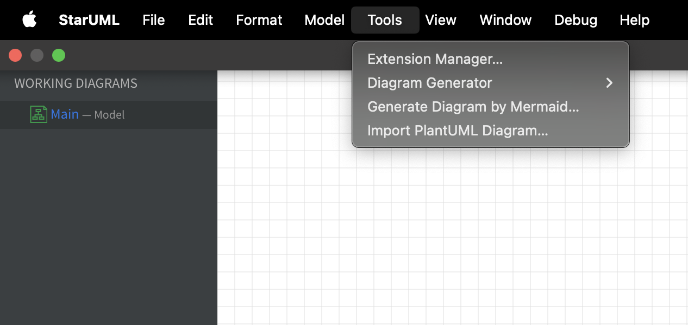
   Tool sẽ tự động nhận diện loại sơ đồ từ code.

4. Màn hình tool sẽ xuất hiện.

   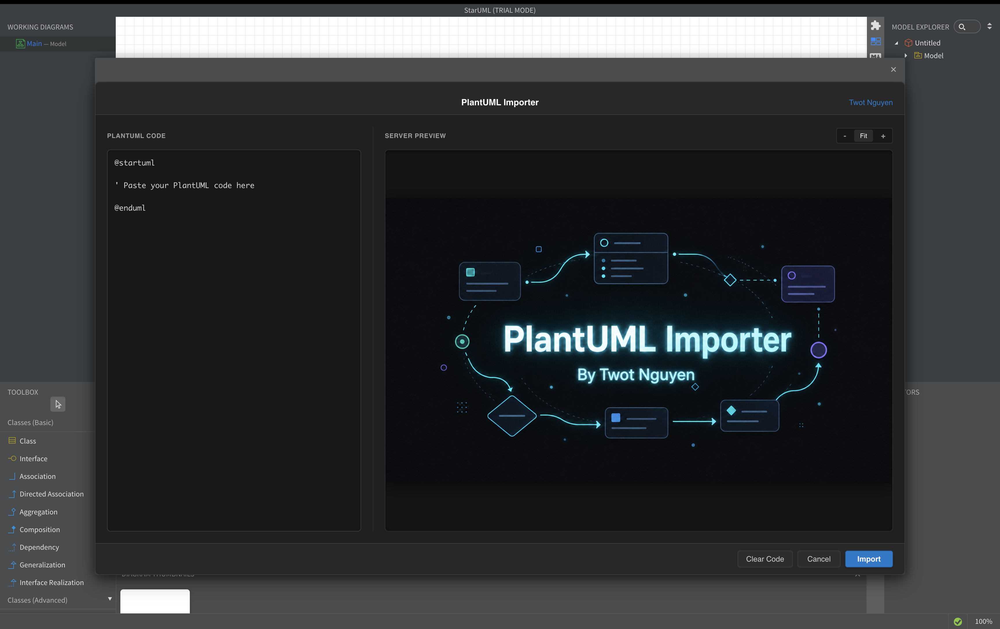

5. Dán code PlantUML vào phần code và phần Preview sẽ hiển thị bên cạnh.

   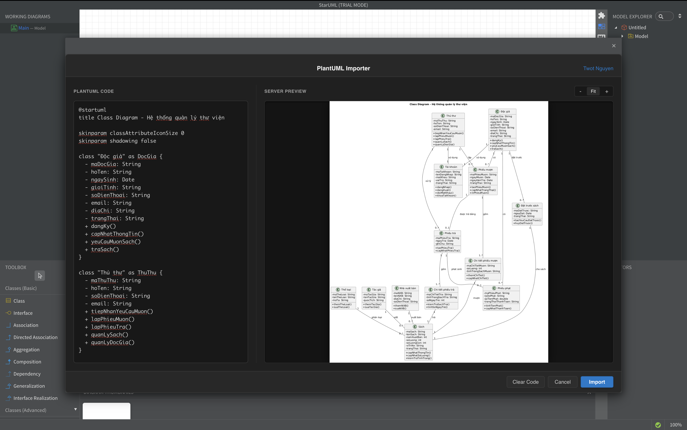

6. Ấn **Import** và chờ đợi tool hoạt động.

   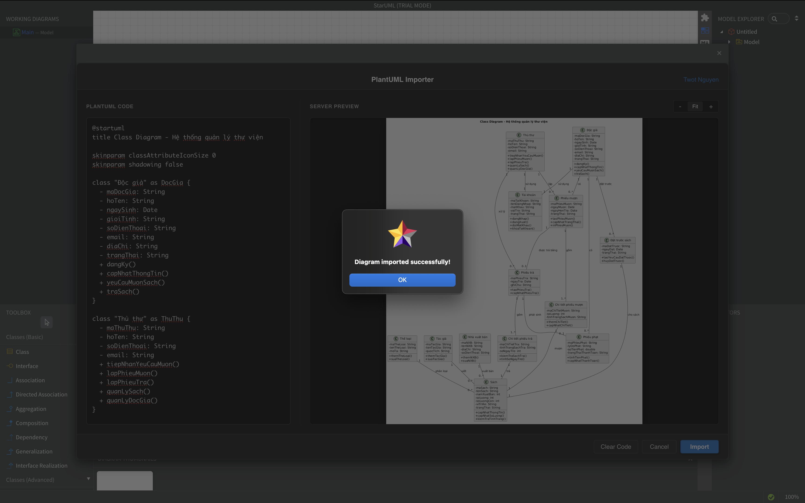
   Tool sẽ báo lỗi nếu bạn chọn sai sơ đồ.

7. Ấn **OK**, xem và chỉnh sửa lại sơ đồ.

   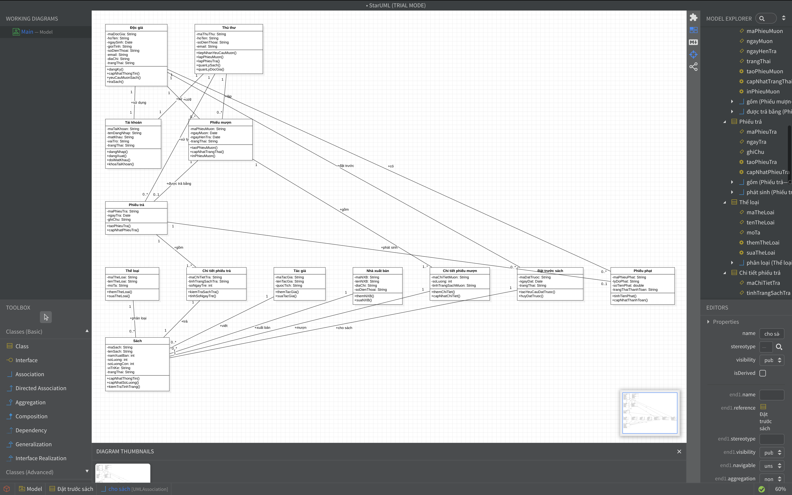

## 📝 Cú pháp PlantUML được hỗ trợ

### Biểu đồ Use Case

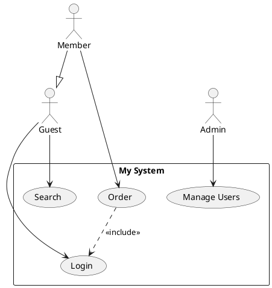

### Biểu đồ Class

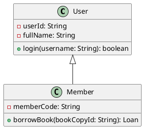

### Biểu đồ Sequence (Tuần tự)

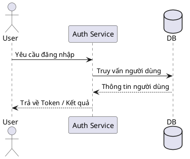

### Biểu đồ Activity (Hoạt động)

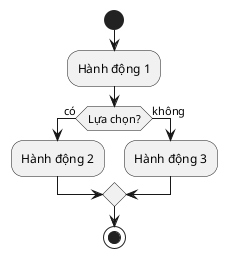

### Biểu đồ State (Trạng thái) (🚧 Đang hoàn thiện — chưa ổn định)

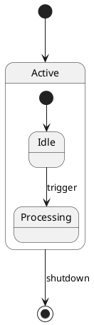

### Biểu đồ ERD (Thực thể - Quan hệ)

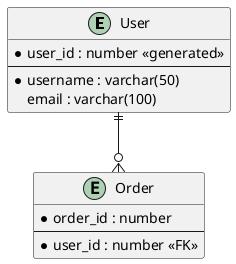

## 📋 Bảng Kiểm Tích Hợp StarUML & Ánh Xạ File Fixture Đại Diện

Bảng dưới đây đóng vai trò là danh sách kiểm tra (checklist) tích hợp StarUML. Nó kết hợp mỗi loại sơ đồ với tệp parser tương ứng và các tệp fixture đại diện trong thư mục `test/` dùng để chạy kiểm thử logic phân tích cú pháp:

| Loại Sơ Đồ | Loại Phần Tử StarUML | Module Parser | File Fixture Đại Diện | Trạng Thái Ổn Định |
| :--- | :--- | :--- | :--- | :--- |
| **Sơ đồ Use Case** | `UMLUseCaseDiagram` | `parsers/usecase-parser.js` | [usecaseC1.puml](file:///Users/twot/Documents/CODE/staruml-plantuml-importer/test/usecaseC1.puml) | Ổn định |
| **Sơ đồ Class** | `UMLClassDiagram` | `parsers/class-parser.js` | [classdiagram.puml](file:///Users/twot/Documents/CODE/staruml-plantuml-importer/test/classdiagram.puml) | Ổn định |
| **Sơ đồ Sequence** | `UMLSequenceDiagram` | `parsers/sequence-parser.js` | [sequence-diagram2.puml](file:///Users/twot/Documents/CODE/staruml-plantuml-importer/test/sequence-diagram2.puml) | Ổn định |
| **Sơ đồ Activity** | `UMLActivityDiagram` | `parsers/activity-parser.js` | [Activity.puml](file:///Users/twot/Documents/CODE/staruml-plantuml-importer/test/Activity.puml) | Ổn định |
| **Sơ đồ State** | `UMLStatechartDiagram` | `parsers/state-parser.js` | [Statechart_Diagram.puml](file:///Users/twot/Documents/CODE/staruml-plantuml-importer/test/Statechart_Diagram.puml) | **🚧 Đang Phát Triển / Chưa Ổn Định** |
| **Sơ đồ ERD** | `ERDDiagram` | `parsers/erd-parser.js` | [ERD.puml](file:///Users/twot/Documents/CODE/staruml-plantuml-importer/test/ERD.puml) | Ổn định |
| **Sơ đồ Mindmap** | `MindmapDiagram` (MMDiagram) | `parsers/mindmap-parser.js` | [mindmap.puml](file:///Users/twot/Documents/CODE/staruml-plantuml-importer/test/mindmap.puml) | Ổn định |

## 🗑️ Gỡ cài đặt hoàn toàn StarUML (Windows & macOS)

> **⚠️ CẢNH BÁO:** Lệnh sau đây **KHÔNG PHẢI** chỉ dùng để gỡ tiện ích. Nó sẽ **GỠ CÀI ĐẶT HOÀN TOÀN** phần mềm StarUML khỏi máy tính của bạn, đồng thời xóa sạch toàn bộ cấu hình, cache, tiện ích mở rộng và log. Chỉ sử dụng khi bạn muốn cài lại từ đầu hoặc xóa hẳn StarUML!
> (Script sẽ yêu cầu bạn gõ `y/N` để xác nhận trước khi thực hiện).

```bash
node manage.js clear-all
```

**Cách dùng Script (Không cần Node.js):**
- **Windows:** Nhấp đúp chuột vào tệp `clear.bat` hoặc chạy `.\clear.bat` trong Command Prompt.
- **macOS / Linux:** Mở Terminal và chạy:
  ```bash
  chmod +x clear.sh
  ./clear.sh
  ```

## 📄 Giấy phép

MIT
