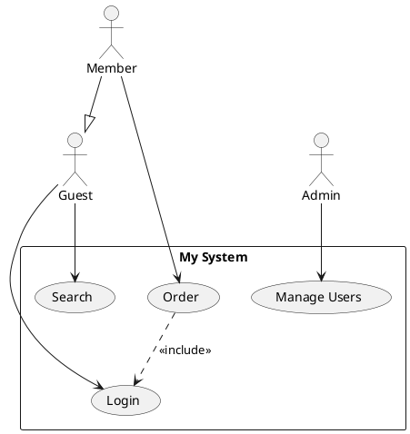
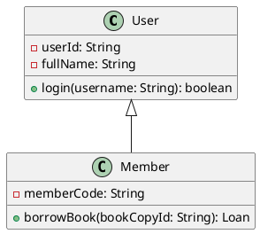
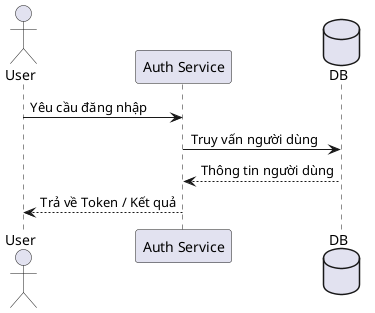
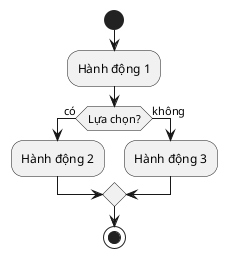
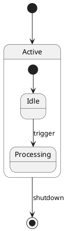
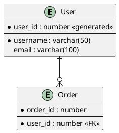

# Bộ nhập sơ đồ PlantUML cho StarUML

[](https://github.com/TwotNguyenVN/staruml-plantuml-importer/releases)
[](https://staruml.io)
[](https://opensource.org/licenses/MIT)
[](https://github.com/TwotNguyenVN/staruml-plantuml-importer/stargazers)
[](https://github.com/TwotNguyenVN/staruml-plantuml-importer/releases)

🌍 **Ngôn ngữ:** [English](README.md) | [Tiếng Việt](README-VN.md)

> Nhập các biểu đồ **Use Case, Class, Sequence, Activity, State, ER, Mindmap và Requirement** được viết
> bằng cú pháp **PlantUML** trực tiếp vào StarUML, và tự động sinh chúng thành các **phần tử UML / SysML
> gốc** kèm theo bố cục tự động, không chồng lấp.


## 📋 Mục lục

- [Tính năng](#-tính-năng-nổi-bật)
- [Các loại sơ đồ được hỗ trợ](#-các-loại-sơ-đồ-được-hỗ-trợ)
- [Cài đặt & Quản lý](#-cài-đặt--quản-lý)
- [Cách sử dụng](#-cách-sử-dụng)
- [Cú pháp PlantUML được hỗ trợ](#-cú-pháp-plantuml-được-hỗ-trợ)
- [Bảng kiểm tích hợp StarUML](#-bảng-kiểm-tích-hợp-staruml)
- [Bảo mật & Máy chủ xem trước](#-bảo-mật--cấu-hình-máy-chủ-xem-trước-preview-server)
- [Chạy kiểm thử](#-chạy-kiểm-thử)
- [Gỡ cài đặt hoàn toàn StarUML](#-gỡ-cài-đặt-hoàn-toàn-staruml-windows--macos)
- [Giấy phép](#-giấy-phép)

## ✨ Tính năng nổi bật

- **Xem trước trực tuyến (Live Server Preview)** — hộp thoại chia đôi màn hình, dựng ảnh xem trước từ mã
  PlantUML của bạn ngay khi đang gõ.
- **Tự động nhận diện loại sơ đồ** — dán bất kỳ đoạn PlantUML được hỗ trợ, công cụ sẽ tự nhận diện kiểu
  sơ đồ (Use Case, Class, Sequence, Activity, State, ER, Mindmap, Requirement).
- **Phần tử StarUML gốc** — mọi sơ đồ được xây dựng từ các kiểu model/view thực của StarUML (ví dụ
  `UMLClass`, `UMLUseCase`, `SysMLRequirement`, `SysMLSatisfy`), nên kết quả hoàn toàn có thể chỉnh sửa.
- **Thuật toán bố cục thông minh**:
  - **Thuật toán phân tầng Enhanced Sugiyama** cho sơ đồ Class giúp dóng hàng và giảm thiểu đan chéo cạnh.
  - **Thuật toán lưới chiếm dụng độ rộng động (Dynamic Width Occupancy Grid)** cho sơ đồ Activity tự động
    co giãn làn bơi, không đè lên nhau.
  - Căn cột cho Use Case, trục thời gian cho Sequence, lồng phân tầng cho State, và bố cục hướng tâm cho
    Mindmap.
- **Hỗ trợ quan hệ đa dạng** — `<<include>>` / `<<extend>>`, thừa kế (generalization), hiện thực hóa giao
  diện, liên kết, thu nạp, hợp thành, lifeline & thông điệp (Sequence), cột PK/FK/Nullable và chân chim
  (ERD), cùng toàn bộ tập quan hệ yêu cầu SysML (satisfy, derive, verify, refine, copy, trace, contain).
- **Tương thích StarUML v7+**.

## 📊 Các loại sơ đồ được hỗ trợ

| Loại sơ đồ | Trạng thái | Ghi chú |
| :--- | :--- | :--- |
| **Use Case Diagram** (Biểu đồ Use Case) | ✅ Đã hỗ trợ | Phân phối dạng cột, bọc hệ thống |
| **Class Diagram** (Biểu đồ lớp) | ✅ Đã hỗ trợ | Bố cục lưới, đầy đủ thuộc tính / phương thức & quan hệ |
| **Sequence Diagram** (Biểu đồ tuần tự) | ✅ Đã hỗ trợ | Sắp xếp theo trình tự thời gian, loại thông điệp, lifelines |
| **Activity Diagram** (Biểu đồ hoạt động) | ✅ Đã hỗ trợ | Phân chia swimlanes, luồng hành động và rẽ nhánh |
| **State Diagram** (Biểu đồ trạng thái) | 🚧 Đang hoàn thiện | Composite state / orthogonal region vẫn có thể bị StarUML từ chối đặt phần tử, chưa ổn định |
| **ER Diagram** (Biểu đồ ERD) | ✅ Đã hỗ trợ | Thực thể, cột (PK/FK/Nullable), quan hệ chân chim |
| **Mindmap** (Sơ đồ tư duy) | ✅ Đã hỗ trợ | Bố cục hướng tâm, phân cấp sâu, hỗ trợ trái/phải |
| **Requirement Diagram** (Biểu đồ yêu cầu) | ✅ Đã hỗ trợ | SysML Requirements, phần tử và mọi loại quan hệ (satisfy / derive / verify / refine / copy / trace / contain) |

## 📦 Cài đặt & Quản lý

Tiện ích đi kèm một script quản lý hợp nhất đa nền tảng (`manage.js`), tự động xử lý cài đặt, cập nhật và
gỡ cài đặt trên Windows, macOS, Linux.

**Yêu cầu:** Máy đã cài [Node.js](https://nodejs.org/).

### Cách sử dụng

Mở Terminal tại thư mục gốc của kho lưu trữ. Có ba cách cài đặt:

#### 1. Chạy tương tác (Khuyên dùng)

```bash
node manage.js
```

Mở menu tương tác, làm theo hướng dẫn trên màn hình.

#### 2. Dòng lệnh nhanh

```bash
node manage.js install   # cài đặt tiện ích
node manage.js update    # kéo code mới nhất từ GitHub và cài lại
node manage.js clear     # chỉ xóa tiện ích khỏi StarUML
```

#### 3. Script hệ thống (Không cần Node.js)

**Windows** — nhấp đúp `install.bat`, hoặc chạy trong Command Prompt:

```bat
.\install.bat
```

**macOS / Linux**:

```bash
chmod +x install.sh
./install.sh
```

> **💡 Lưu ý:** Sau khi cài đặt hoặc cập nhật, vui lòng khởi động lại (hoặc nhấn `Ctrl/Cmd + R` để reload) StarUML.

## 🚀 Cách sử dụng

1. Mở StarUML.
2. Tạo sẵn sơ đồ đích:
   - Use Case: `Model → Add Diagram → Use Case Diagram`
   - Class: `Model → Add Diagram → Class Diagram`
   - Sequence: `Model → Add Diagram → Sequence Diagram`
   - Activity: `Model → Add Diagram → Activity Diagram`
   - State: `Model → Add Diagram → Statechart Diagram`
   - ERD: `Model → Add Diagram → ER Diagram`
   - **Requirement: `Model → Add Diagram → Requirement Diagram`** (thuộc nhóm SysML)
3. Mở bộ nhập qua **`Tools → PlantUML Importer...`**, hoặc dùng phím tắt:
   - **macOS:** `Cmd + I`
   - **Windows / Linux:** `Ctrl + I`

   *(💡 Mẹo: nhấn phím tắt lần nữa để đóng nhanh hộp thoại. Trường nhập được tự động focus để bạn dán code
   ngay lập tức.)*
4. Dán mã PlantUML; bản xem trước hiển thị bên phải.
5. Nhấn **Import**. Bộ nhập tự nhận diện loại sơ đồ và đối chiếu với sơ đồ đang mở; nếu không khớp, bạn sẽ
   được cảnh báo trước khi tạo bất kỳ phần tử nào.
6. Nhấn **OK**, xem và tinh chỉnh sơ đồ.


## 📝 Cú pháp PlantUML được hỗ trợ

### Biểu đồ Use Case



### Biểu đồ Class



### Biểu đồ Sequence (Tuần tự)



### Biểu đồ Activity (Hoạt động)



### Biểu đồ State (Trạng thái) (🚧 Đang hoàn thiện — chưa ổn định)



### Biểu đồ ERD (Thực thể - Quan hệ)



### Biểu đồ Requirement (Yêu cầu)

```plantuml
@startuml
requirement "User can log in" as R1 {
  id: 1
  text: The system shall allow a registered user to log in with email and password.
  risk: low
  verifymethod: test
}
requirement "User can reset password" as R2 {
  id: 2
  text: The system shall allow a user to reset a forgotten password via email.
}
requirement "Login must be fast" as R3 {
  id: 3
  text: Login response time shall be under 500ms under normal load.
}

element "Auth Service" as E1
element "Email Gateway" as E2

R1 -satisfies-> E1
R2 -satisfies-> E2
R3 -derives-> R1
R1 -verifies-> R2
R2 -refines-> R1
R3 -traces-> R1
R1 -copies-> R2
R1 -contains-> E1
@enduml
```

## 📋 Bảng kiểm tích hợp StarUML

Bảng dưới ánh xạ mỗi loại sơ đồ với module parser tương ứng và file fixture kiểm thử đại diện dùng để xác
minh tính đúng đắn của logic phân tích cú pháp.

| Loại sơ đồ | Kiểu phần tử StarUML | Module parser | File fixture | Trạng thái |
| :--- | :--- | :--- | :--- | :--- |
| **Sơ đồ Use Case** | `UMLUseCaseDiagram` | `parsers/usecase-parser.js` | [usecaseC1.puml](test/usecaseC1.puml) | Ổn định |
| **Sơ đồ Class** | `UMLClassDiagram` | `parsers/class-parser.js` | [classdiagram.puml](test/classdiagram.puml) | Ổn định |
| **Sơ đồ Sequence** | `UMLSequenceDiagram` | `parsers/sequence-parser.js` | [sequence-diagram2.puml](test/sequence-diagram2.puml) | Ổn định |
| **Sơ đồ Activity** | `UMLActivityDiagram` | `parsers/activity-parser.js` | [Activity.puml](test/Activity.puml) | Ổn định |
| **Sơ đồ State** | `UMLStatechartDiagram` | `parsers/state-parser.js` | [Statechart_Diagram.puml](test/Statechart_Diagram.puml) | 🚧 Đang phát triển |
| **Sơ đồ ERD** | `ERDDiagram` | `parsers/erd-parser.js` | [ERD.puml](test/ERD.puml) | Ổn định |
| **Sơ đồ Mindmap** | `MindmapDiagram` (MMDiagram) | `parsers/mindmap-parser.js` | [mindmap.puml](test/mindmap.puml) | Ổn định |
| **Sơ đồ Requirement** | `SysMLRequirementDiagram` | `parsers/requirement-parser.js` | [requirement_sample.puml](test/requirement_sample.puml) | Ổn định |

## 🔒 Bảo mật & Cấu hình máy chủ xem trước (Preview Server)

Mặc định, tính năng Xem trước trực tuyến gửi mã PlantUML của bạn (dạng nén/mã hóa) đến máy chủ dựng ảnh
công khai của PlantUML (`https://www.plantuml.com/plantuml`).

Nếu bạn làm việc với kiến trúc nhạy cảm hoặc nội bộ doanh nghiệp, bạn có thể trỏ tiện ích về máy chủ
PlantUML tự host (self-hosted) hoặc tắt hoàn toàn xem trước:

1. Mở **StarUML**.
2. Vào **StarUML → Preferences → PlantUML Importer**.
3. Tùy chỉnh:
   - **PlantUML Server URL**: máy chủ nội bộ của bạn (vd `http://localhost:8080` hoặc
     `https://plantuml.yourcompany.com`). Tiện ích tự động chuẩn hóa URL (bỏ dấu gạch chéo/thành phần dư
     thừa như `/png`) và ưu tiên HTTPS cho tên miền từ xa.
   - **Enable Preview**: bỏ chọn để tắt hoàn toàn kết nối máy chủ xem trước. Khi tắt, không mã nào được gửi
     qua mạng và khung xem trước hiển thị thông báo đã tắt.

## 🧪 Chạy kiểm thử

Bộ kiểm thử chạy hoàn toàn trên Node.js (không cần StarUML) nhờ một API StarUML được mock:

```bash
npm test
# tương đương với:
node test/run_all_tests.js
```

Mỗi parser có một fixture riêng trong `test/` và một script kiểm thử tương ứng (vd
`test/run_requirement_test.js` cho parser Requirement). Mọi script phải thoát với mã `0`.

## 🗑️ Gỡ cài đặt hoàn toàn StarUML (Windows & macOS)

> **⚠️ CẢNH BÁO:** Lệnh sau **KHÔNG PHẢI** chỉ gỡ tiện ích. Nó sẽ **GỠ CÀI ĐẶT HOÀN TOÀN** StarUML và
> xóa sạch mọi cấu hình, cache, tiện ích mở rộng và log. Chỉ dùng khi muốn cài lại từ đầu.
> (Script sẽ yêu cầu gõ `y/N` xác nhận trước khi thực hiện.)

```bash
node manage.js clear-all
```

**Script hệ thống (không cần Node.js):**

- **Windows:** nhấp đúp `clear.bat`, hoặc chạy `.\clear.bat` trong Command Prompt.
- **macOS / Linux:** `chmod +x clear.sh && ./clear.sh`

## 📄 Giấy phép

MIT
