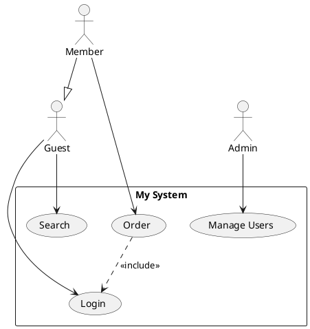
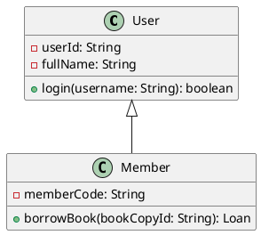
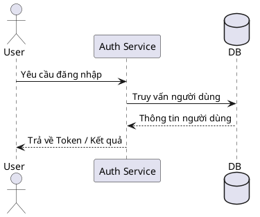

# Bộ nhập sơ đồ PlantUML cho StarUML

🌍 **Ngôn ngữ:** [English](README.md) | [Tiếng Việt](README-VN.md)

Tiện ích mở rộng dành cho StarUML hỗ trợ phân tích và nhập các loại **Sơ đồ Use Case**, **Sơ đồ lớp (Class Diagram)**, và **Sơ đồ tuần tự (Sequence Diagram)** từ cú pháp **PlantUML**, từ đó tự động sinh chúng thành các phần tử UML gốc bên trong StarUML.

## ✨ Các tính năng nổi bật

- Phân tích cú pháp PlantUML cho biểu đồ Use Case, Class và Sequence.
- Thuật toán bố cục tự động: Bố cục lưới thông minh cho Class Diagram, căn cột ngang cho Use Case, và xếp chồng thông điệp theo trục thời gian đứng trên Sequence Diagram.
- Hỗ trợ đầy đủ các thuộc tính, phương thức, phạm vi truy cập (visibility) và bội số (multiplicities) trên Class Diagram.
- Hỗ trợ các quan hệ: `<<include>>`, `<<extend>>`, thừa kế (generalization), hiện thực hóa giao diện (interface realization), liên kết (association), thu nạp (aggregation) và hợp thành (composition).
- Hỗ trợ đầy đủ các loại lifeline (`actor`, `participant`, `boundary`, `control`, `entity`, `database`, `collections`) và đường thông điệp (`->`, `-->`, `->>`, `->*`, `->x`) trên Sequence Diagram.
- Tương thích tốt với **StarUML v7+**.

## 📦 Cài đặt

### Cài đặt nhanh

#### Windows
1. Tải về hoặc nhân bản (clone) kho lưu trữ này.
2. **Nhấp đúp** vào file `install.bat`.
3. Khởi động lại StarUML.

#### macOS / Linux
Chạy lệnh sau trong Terminal:
```bash
chmod +x install.sh
./install.sh
```

### Cài đặt thủ công

Sao chép toàn bộ nội dung của kho lưu trữ này vào thư mục extension tương ứng của StarUML:

| Hệ điều hành | Đường dẫn thư mục cài đặt |
|:---|:---|
| Windows | `%APPDATA%\StarUML\extensions\user\staruml-plantuml-importer` |
| macOS | `~/Library/Application Support/StarUML/extensions/user/staruml-plantuml-importer` |
| Linux | `~/.config/StarUML/extensions/user/staruml-plantuml-importer` |

Sau đó khởi động lại StarUML.

## 🚀 Cách sử dụng

1. Mở ứng dụng StarUML.
2. Tạo một biểu đồ mới:
   - Sơ đồ Use Case: `Model` → `Add Diagram` → `Use Case Diagram`
   - Sơ đồ Class: `Model` → `Add Diagram` → `Class Diagram`
   - Sơ đồ Sequence: `Model` → `Add Diagram` → `Sequence Diagram`
3. Truy cập: **`Tools` → `PlantUML Importer` → Chọn lệnh nhập tương ứng**.
4. Dán đoạn mã PlantUML vào hộp thoại.
5. Nhấp **OK** — sơ đồ sẽ được tự động vẽ ra trên canvas!

## 📝 Cú pháp PlantUML được hỗ trợ

### Biểu đồ Use Case



### Biểu đồ Class



### Biểu đồ Sequence (Tuần tự)



## 📄 Giấy phép

MIT
