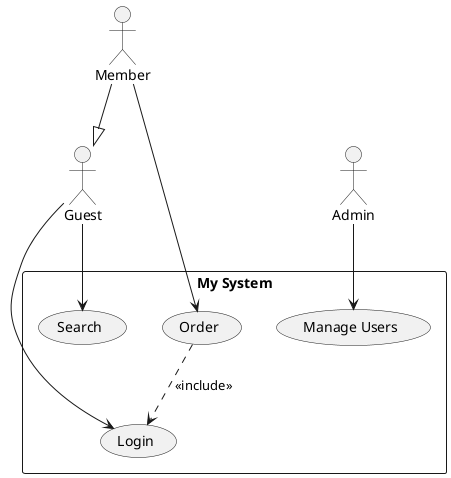
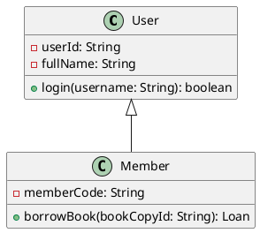
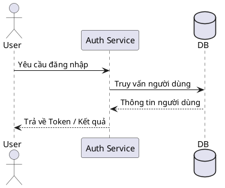
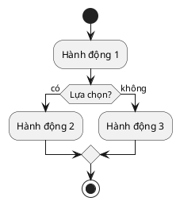
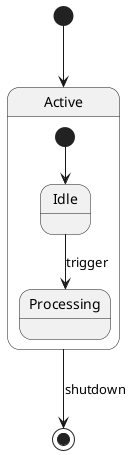
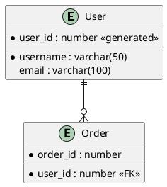

# Bộ nhập sơ đồ PlantUML cho StarUML

🌍 **Ngôn ngữ:** [English](README.md) | [Tiếng Việt](README-VN.md)

Tiện ích mở rộng dành cho StarUML hỗ trợ phân tích và nhập các loại biểu đồ **Use Case, Class, Sequence, Activity, State và ER Diagrams** từ cú pháp **PlantUML**, từ đó tự động sinh chúng thành các phần tử UML gốc bên trong StarUML.

## 📊 Sơ đồ hỗ trợ & Kế hoạch phát triển

| Loại sơ đồ | Trạng thái | Ghi chú |
|:---|:---|:---|
| **Use Case Diagram** (Biểu đồ Use Case) | ✅ Đã hỗ trợ | Phân phối dạng cột, bọc hệ thống |
| **Class Diagram** (Biểu đồ lớp) | ✅ Đã hỗ trợ | Bố cục dạng lưới, đầy đủ thuộc tính/phương thức & quan hệ |
| **Sequence Diagram** (Biểu đồ tuần tự) | ✅ Đã hỗ trợ | Sắp xếp theo trình tự thời gian, loại thông điệp, lifelines |
| **Activity Diagram** (Biểu đồ hoạt động) | ✅ Đã hỗ trợ | Phân chia swimlanes (làn bơi), các luồng hành động và rẽ nhánh |
| **State Diagram** (Biểu đồ trạng thái) | ✅ Đã hỗ trợ | Hỗ trợ composite state, phân vùng region con, các pseudostate |
| **ER Diagram** (Biểu đồ ERD) | ✅ Đã hỗ trợ | Thực thể, kiểu dữ liệu cột (PK/FK/Nullable), quan hệ chân chim |
| **Mindmap** (Sơ đồ tư duy) | ⏳ Sắp hỗ trợ | Lên kế hoạch cập nhật trong tương lai |
| **Requirement Diagram** (Biểu đồ yêu cầu) | ⏳ Sắp hỗ trợ | Lên kế hoạch cập nhật trong tương lai |

## ✨ Các tính năng nổi bật

- **Xem trước trực tuyến (Live Server Preview):** Hộp thoại chia đôi màn hình cho phép dán code bên trái và bấm **Preview** để xem trước ảnh render sơ đồ từ máy chủ PlantUML bên phải trước khi import.
- Phân tích cú pháp PlantUML cho biểu đồ Use Case, Class, Sequence, Activity, State và ERD.
- Thuật toán bố cục tự động cực kỳ thông minh: 
  - **Thuật toán Phân tầng Enhanced Sugiyama** cho sơ đồ Class giúp dóng hàng thẳng tắp và hạn chế tối đa việc đan chéo dây.
  - **Thuật toán Độ rộng động (Dynamic Width Occupancy Grid)** cho sơ đồ Activity giúp tự động nới rộng làn bơi và ngăn các khối đâm vào nhau.
  - Căn cột ngang cho Use Case, xếp chồng trục đứng trên Sequence, và lồng phân tầng cho State.
- Hỗ trợ đầy đủ các thuộc tính, phương thức, phạm vi truy cập (visibility) và bội số (multiplicities) trên Class Diagram.
- Hỗ trợ các quan hệ: `<<include>>`, `<<extend>>`, thừa kế (generalization), hiện thực hóa giao diện (interface realization), liên kết (association), thu nạp (aggregation) và hợp thành (composition).
- Hỗ trợ đầy đủ các loại lifeline (`actor`, `participant`, `boundary`, `control`, `entity`, `database`, `collections`) và đường thông điệp (`->`, `-->`, `->>`, `->*`, `->x`) trên Sequence Diagram.
- Hỗ trợ đầy đủ định nghĩa cột ERD (Khóa chính PK, Khóa ngoại FK, Nullable) và các chân quan hệ chân chim chuẩn xác.
- Tương thích tốt với **StarUML v7+**.

## 📦 Cài đặt

### Cài đặt nhanh

#### Windows
1. Tải về hoặc nhân bản (clone) kho lưu trữ này.
2. **Nhấp đúp** vào file `install.bat`.
3. Khởi động lại StarUML.

#### macOS / Linux
Chạy lệnh sau trong Terminal:
```bash
chmod +x install.sh
./install.sh
```

### Cài đặt thủ công

Sao chép toàn bộ nội dung của kho lưu trữ này vào thư mục extension tương ứng của StarUML:

| Hệ điều hành | Đường dẫn thư mục cài đặt |
|:---|:---|
| Windows | `%APPDATA%\StarUML\extensions\user\staruml-plantuml-importer` |
| macOS | `~/Library/Application Support/StarUML/extensions/user/staruml-plantuml-importer` |
| Linux | `~/.config/StarUML/extensions/user/staruml-plantuml-importer` |

Sau đó khởi động lại StarUML.

## 🚀 Cách sử dụng

1. Mở ứng dụng StarUML.
2. Tạo một biểu đồ mới:
   - Sơ đồ Use Case: `Model` → `Add Diagram` → `Use Case Diagram`
   - Sơ đồ Class: `Model` → `Add Diagram` → `Class Diagram`
   - Sơ đồ Sequence: `Model` → `Add Diagram` → `Sequence Diagram`
   - Sơ đồ Activity: `Model` → `Add Diagram` → `Activity Diagram`
   - Sơ đồ State: `Model` → `Add Diagram` → `Statechart Diagram`
   - Sơ đồ ERD: `Model` → `Add Diagram` → `ER Diagram`
3. Truy cập: **`Tools` → `PlantUML Importer` → Chọn lệnh nhập tương ứng**.
4. Dán đoạn mã PlantUML vào hộp thoại.
5. Nhấp **Preview** để xem trước ảnh render trực tuyến từ server, sau đó nhấp **Import** để tự động sinh sơ đồ lên canvas!

## 📝 Cú pháp PlantUML được hỗ trợ

### Biểu đồ Use Case



### Biểu đồ Class



### Biểu đồ Sequence (Tuần tự)



### Biểu đồ Activity (Hoạt động)



### Biểu đồ State (Trạng thái)



### Biểu đồ ERD (Thực thể - Quan hệ)



## 🗑️ Gỡ cài đặt hoàn toàn StarUML (Windows & macOS)

> **⚠️ CẢNH BÁO:** Các file `clear.bat` và `clear.sh` **KHÔNG PHẢI** dùng để gỡ mỗi tiện ích này. Chúng sẽ **GỠ CÀI ĐẶT HOÀN TOÀN** phần mềm StarUML khỏi máy tính của bạn, đồng thời xóa sạch toàn bộ cấu hình, cache, tiện ích mở rộng và log. Chỉ sử dụng khi bạn muốn cài lại từ đầu hoặc xóa hẳn StarUML!

Nếu bạn chỉ muốn gỡ cài đặt **Tiện ích PlantUML Importer**, bạn chỉ cần xóa thư mục `staruml-plantuml-importer` nằm trong thư mục `extensions/user/` của StarUML là xong.

#### Windows
**Nhấp đúp** vào file `clear.bat` hoặc chạy nó qua Command Prompt.

#### macOS
Chạy lệnh sau:
```bash
chmod +x clear.sh
./clear.sh
```

## 📄 Giấy phép

MIT
