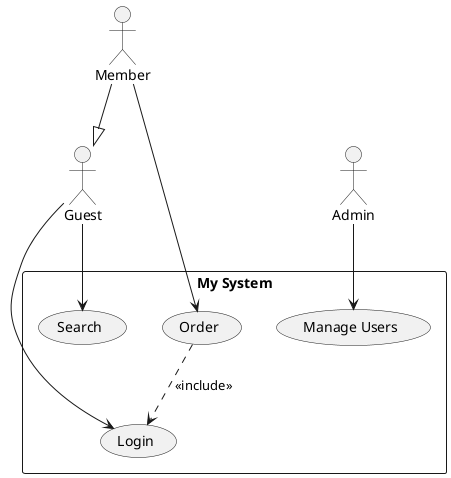
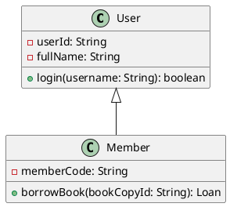

# StarUML PlantUML Diagram Importer

A StarUML extension that imports **Use Case Diagrams** and **Class Diagrams** from **PlantUML** syntax and auto-generates them as native UML elements inside StarUML.

## ✨ Features

- Parse PlantUML Use Case and Class Diagram syntax
- Smart Grid layout for Class Diagrams and column distribution for Use Cases
- Support for attributes, operations, visibilities, and multiplicities (Class Diagram)
- Support for `<<include>>`, `<<extend>>`, generalization, interface realization, associations, aggregations, and compositions
- Compatible with **StarUML v7+**

## 📦 Installation

### Quick Install

#### Windows
1. Download or clone this repository
2. **Double-click** `install.bat`
3. Restart StarUML

#### macOS / Linux
```bash
chmod +x install.sh
./install.sh
```

### Manual Installation

Copy the entire `staruml-plantuml-importer` folder to:

| OS      | Path                                                                   |
|---------|------------------------------------------------------------------------|
| Windows | `%APPDATA%\StarUML\extensions\user\staruml-plantuml-importer`           |
| macOS   | `~/Library/Application Support/StarUML/extensions/user/staruml-plantuml-importer` |
| Linux   | `~/.config/StarUML/extensions/user/staruml-plantuml-importer`           |

Then restart StarUML.

## 🚀 How to Use

1. Open StarUML
2. Create a Diagram:
   - For Use Case: `Model` → `Add Diagram` → `Use Case Diagram`
   - For Class: `Model` → `Add Diagram` → `Class Diagram`
3. Go to `Tools` → `PlantUML Importer` → Select your import command
4. Paste your PlantUML code in the dialog
5. Click **OK** — the diagram will be generated automatically!

## 📝 Supported PlantUML Syntax

### Use Case Diagram



### Class Diagram



## 📄 License

MIT
