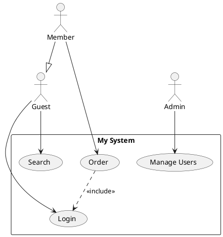
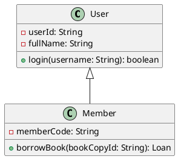
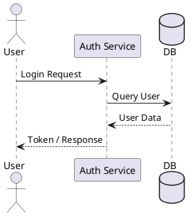
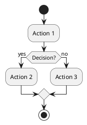
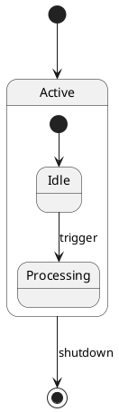
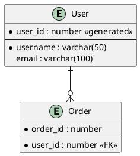

# StarUML PlantUML Diagram Importer

🌍 **Language:** [English](README.md) | [Tiếng Việt](README-VN.md)

A StarUML extension that imports **Use Case, Class, Sequence, Activity, State, and ER Diagrams** from **PlantUML** syntax and auto-generates them as native UML elements inside StarUML.

## 📊 Supported & Planned Diagrams

| Diagram Type | Status | Notes |
|:---|:---|:---|
| **Use Case Diagram** | ✅ Supported | Column layout, system boundary |
| **Class Diagram** | ✅ Supported | Grid layout, full attributes/methods & associations |
| **Sequence Diagram** | ✅ Supported | Chronological layout, message types, actor lifelines |
| **Activity Diagram** | ✅ Supported | Partition swimlanes, action flows, and decisions |
| **State Diagram** | ✅ Supported | Composite states, region sub-containers, transitions |
| **ER Diagram** | ✅ Supported | Entities, columns (PK/FK/Nullable), crow's foot cardinalities |
| **Mindmap** | ⏳ Planned | Planned for future update |
| **Requirement Diagram** | ⏳ Planned | Planned for future update |

## ✨ Features

- **Live Server Preview:** Interactive side-by-side modal displaying diagram preview rendered directly from the PlantUML server.
- Parse PlantUML Use Case, Class, Sequence, Activity, State, and ER Diagram syntax.
- Smart layout algorithms: 
  - **Enhanced Sugiyama Hierarchical Layout** for Class Diagrams to minimize edge crossings.
  - **Dynamic Width Occupancy Grid Layout** for Activity Diagrams to automatically adjust swimlanes and prevent overlapping.
  - Column distribution for Use Case, chronological timeline layout for Sequence, and nested containment for State.
- Support for attributes, operations, visibilities, and multiplicities (Class Diagram).
- Support for `<<include>>`, `<<extend>>`, generalization, interface realization, associations, aggregations, and compositions.
- Support for lifelines (`actor`, `participant`, `boundary`, `control`, `entity`, `database`, `collections`) and message lines (`->`, `-->`, `->>`, `->*`, `->x`) in Sequence Diagrams.
- Support for ERD columns (Primary Keys, Foreign Keys, Nullability) and crow's foot notation.
- Compatible with **StarUML v7+**

## 📦 Installation

### Quick Install

#### Windows
1. Download or clone this repository
2. **Double-click** `install.bat`
3. Restart StarUML

#### macOS / Linux
```bash
chmod +x install.sh
./install.sh
```

### Manual Installation

Copy the content of this repository (or the folder `staruml-plantuml-importer`) to:

| OS      | Path                                                                   |
|---------|------------------------------------------------------------------------|
| Windows | `%APPDATA%\StarUML\extensions\user\staruml-plantuml-importer`           |
| macOS   | `~/Library/Application Support/StarUML/extensions/user/staruml-plantuml-importer` |
| Linux   | `~/.config/StarUML/extensions/user/staruml-plantuml-importer`           |

Then restart StarUML.

## 🚀 How to Use

1. Open StarUML
2. Create a Diagram:
   - For Use Case: `Model` → `Add Diagram` → `Use Case Diagram`
   - For Class: `Model` → `Add Diagram` → `Class Diagram`
   - For Sequence: `Model` → `Add Diagram` → `Sequence Diagram`
   - For Activity: `Model` → `Add Diagram` → `Activity Diagram`
   - For State: `Model` → `Add Diagram` → `Statechart Diagram`
   - For ERD: `Model` → `Add Diagram` → `ER Diagram`
3. Go to **`Tools` → `PlantUML Importer`** and select your import command.

   

4. The importer dialog will appear.

   

5. Paste your PlantUML code into the input field; the Preview will be displayed on the right.

   

6. Click **Import** and wait for the tool to process.

   

7. Click **OK**, then view and edit your generated diagram.

   

## 📝 Supported PlantUML Syntax

### Use Case Diagram



### Class Diagram



### Sequence Diagram



### Activity Diagram



### State Diagram



### ER Diagram



## 🗑️ Clean Uninstallation of StarUML (Windows & macOS)

> **⚠️ WARNING:** The `clear.bat` and `clear.sh` scripts **DO NOT** just uninstall the extension. They will **COMPLETELY UNINSTALL** the StarUML application from your system and wipe all of its configurations, caches, extensions, and logs. Only use this if you want a fresh start or want to remove StarUML completely!

If you only want to uninstall the **PlantUML Importer Extension**, simply delete the `staruml-plantuml-importer` folder from your StarUML `extensions/user/` directory.

#### Windows
**Double-click** `clear.bat` or run it from command prompt.

#### macOS
Run:
```bash
chmod +x clear.sh
./clear.sh
```

## 📄 License

MIT

