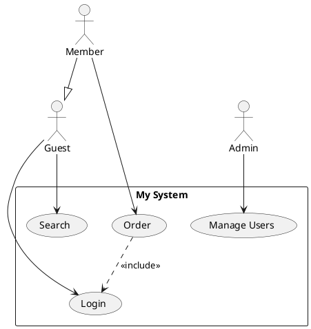

[](https://smithery.ai/server/@staruml/staruml-mcp-server)

# StarUML MCP Server

[StarUML](https://staruml.io) is a sophisticated modeler for agile and concise modeling. **StarUML MCP Server** enables you to create diagrams or generate codes from diagrams in StarUML via prompts.

## Setup

Prerequisite:

- [StarUML](https://staruml.io/) `v7.0.0` or higher
- [Node.js](https://nodejs.org/) `v22` or higher

Set up `claude_desktop_config.json` in Claude Desktop as follows:

```json
{
  "mcpServers": {
    "staruml-mcp-server": {
      "command": "npx",
      "args": ["-y", "staruml-mcp-server"]
    }
  }
}
```

You can use the `--api-port=<port>` option to change the API server port for StarUML.

## Example Prompts

- _"Create a class diagram for book store in StarUML"_
- _"Create a sequence diagram for OAuth authentication in StarUML"_
- _"Generate SQL DDL from the current ERD diagram in StarUML"_

## Tools

- `generate_diagram`
- `get_current_diagram_info`
- `get_all_diagrams_info`
- `get_diagram_image_by_id`

## Dev

1. Clone this repository.
2. Build with `npm run build`.
3. Update `claude_desktop_config.json` in Claude Desktop as below.
4. Restart Claude Desktop.

```json
{
  "mcpServers": {
    "staruml-mcp-server": {
      "command": "node",
      "args": ["<full-path-to>/staruml-mcp-server/build/index.js"]
    }
  }
}
```

## Use Case Diagram Importer (Extension)

This repository also includes a **StarUML extension** that imports **Use Case Diagrams** from **PlantUML** syntax and auto-generates them as native UML elements inside StarUML.

### ✨ Features

- Parse PlantUML Use Case syntax (actors, use cases, relationships)
- Auto-layout with smart column distribution
- Support for `<<include>>`, `<<extend>>`, and generalization relationships
- Separate primary actors (left) and secondary/system actors (right)
- Compatible with **StarUML v7+**

### 📦 Installation

#### Quick Install
- **Windows:** Double-click `staruml-usecase-importer\install.bat`
- **macOS / Linux:** Run `chmod +x staruml-usecase-importer/install.sh && ./staruml-usecase-importer/install.sh`

#### Manual Installation
Copy the entire `staruml-usecase-importer` folder to:

| OS      | Path                                                                   |
|---------|------------------------------------------------------------------------|
| Windows | `%APPDATA%\StarUML\extensions\user\staruml-usecase-importer`           |
| macOS   | `~/Library/Application Support/StarUML/extensions/user/staruml-usecase-importer` |
| Linux   | `~/.config/StarUML/extensions/user/staruml-usecase-importer`           |

Then restart StarUML.

### 🚀 How to Use

1. Open StarUML
2. Create a **Use Case Diagram**: `Model` → `Add Diagram` → `Use Case Diagram`
3. Go to `Tools` → **"Import Use Case from PlantUML..."**
4. Paste your PlantUML code in the dialog
5. Click **OK** — the diagram will be generated automatically!

### 📝 Supported PlantUML Syntax



#### Supported Elements

| Element           | Syntax                                    |
|-------------------|-------------------------------------------|
| Actor             | `actor "Name" as Alias`                   |
| Use Case          | `usecase "Name" as Alias`                 |
| Association       | `Actor --> UseCase`                       |
| Include           | `UC1 ..> UC2 : <<include>>`               |
| Extend            | `UC1 ..> UC2 : <<extend>>`                |
| Generalization    | `Child --|> Parent`                       |

