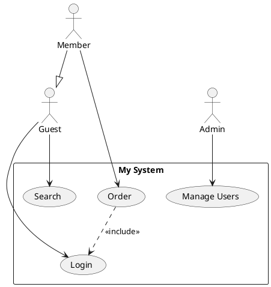
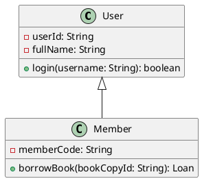
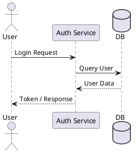

# StarUML PlantUML Diagram Importer

🌍 **Language:** [English](README.md) | [Tiếng Việt](README-VN.md)

A StarUML extension that imports **Use Case Diagrams**, **Class Diagrams**, and **Sequence Diagrams** from **PlantUML** syntax and auto-generates them as native UML elements inside StarUML.

## 📊 Supported & Planned Diagrams

| Diagram Type | Status | Notes |
|:---|:---|:---|
| **Use Case Diagram** | ✅ Supported | Column layout, system boundary |
| **Class Diagram** | ✅ Supported | Grid layout, full attributes/methods & associations |
| **Sequence Diagram** | ✅ Supported | Chronological layout, message types, actor icons |
| **Flowchart** | ⏳ Planned | Planned for future update |
| **ER Diagram** | ⏳ Planned | Planned for future update |
| **Mindmap** | ⏳ Planned | Planned for future update |
| **Requirement Diagram** | ⏳ Planned | Planned for future update |
| **State Diagram** | ⏳ Planned | Planned for future update |

## ✨ Features

- Parse PlantUML Use Case, Class, and Sequence Diagram syntax
- Smart Grid layout for Class Diagrams, column distribution for Use Case Diagrams, and chronological timeline layout for Sequence Diagrams
- Support for attributes, operations, visibilities, and multiplicities (Class Diagram)
- Support for `<<include>>`, `<<extend>>`, generalization, interface realization, associations, aggregations, and compositions
- Support for lifelines (`actor`, `participant`, `boundary`, `control`, `entity`, `database`, `collections`) and message lines (`->`, `-->`, `->>`, `->*`, `->x`) in Sequence Diagrams
- Compatible with **StarUML v7+**

## 📦 Installation

### Quick Install

#### Windows
1. Download or clone this repository
2. **Double-click** `install.bat`
3. Restart StarUML

#### macOS / Linux
```bash
chmod +x install.sh
./install.sh
```

### Manual Installation

Copy the content of this repository (or the folder `staruml-plantuml-importer`) to:

| OS      | Path                                                                   |
|---------|------------------------------------------------------------------------|
| Windows | `%APPDATA%\StarUML\extensions\user\staruml-plantuml-importer`           |
| macOS   | `~/Library/Application Support/StarUML/extensions/user/staruml-plantuml-importer` |
| Linux   | `~/.config/StarUML/extensions/user/staruml-plantuml-importer`           |

Then restart StarUML.

## 🚀 How to Use

1. Open StarUML
2. Create a Diagram:
   - For Use Case: `Model` → `Add Diagram` → `Use Case Diagram`
   - For Class: `Model` → `Add Diagram` → `Class Diagram`
   - For Sequence: `Model` → `Add Diagram` → `Sequence Diagram`
3. Go to `Tools` → `PlantUML Importer` → Select your import command
4. Paste your PlantUML code in the dialog
5. Click **OK** — the diagram will be generated automatically!

## 📝 Supported PlantUML Syntax

### Use Case Diagram



### Class Diagram



### Sequence Diagram



## 🗑️ Clean Uninstallation (macOS)

If you need to completely remove StarUML and all of its configurations, caches, extensions, and logs from your macOS device, you can use the provided uninstaller script:

```bash
chmod +x clear.sh
./clear.sh
```

## 📄 License

MIT

