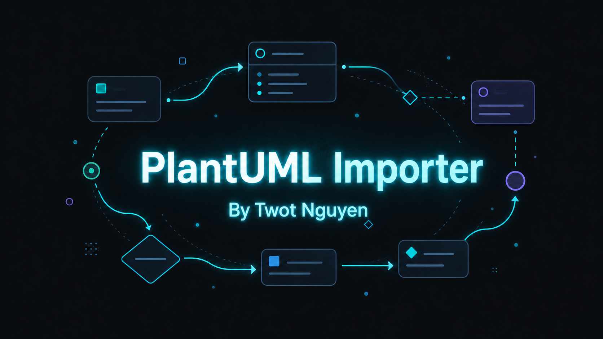
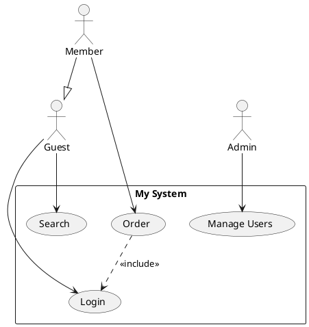
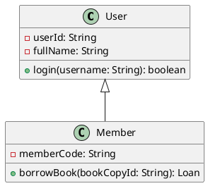
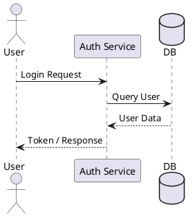
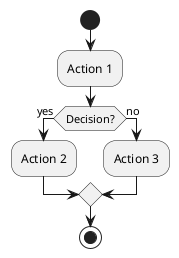
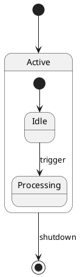
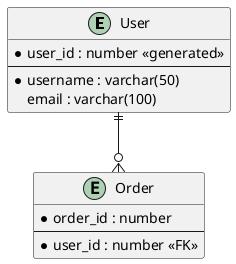

# PlantUML Importer for StarUML

[](https://github.com/TwotNguyenVN/staruml-plantuml-importer/releases)
[](https://staruml.io)
[](https://opensource.org/licenses/MIT)
[](https://github.com/TwotNguyenVN/staruml-plantuml-importer/stargazers)
[](https://github.com/TwotNguyenVN/staruml-plantuml-importer/releases)

🌍 **Language:** [English](README.md) | [Tiếng Việt](README-VN.md)

> Import **Use Case, Class, Sequence, Activity, State, ER, Mindmap, and Requirement** diagrams written in
> **PlantUML** syntax directly into StarUML, and have them generated as **native UML / SysML elements**
> with automatic, conflict-free layout.



## 📋 Table of Contents

- [Features](#-features)
- [Supported Diagram Types](#-supported-diagram-types)
- [Installation & Management](#-installation--management)
- [How to Use](#-how-to-use)
- [Supported PlantUML Syntax](#-supported-plantuml-syntax)
- [StarUML Integration Checklist](#-staruml-integration-checklist)
- [Privacy & Preview Server](#-privacy--preview-server-configuration)
- [Running Tests](#-running-tests)
- [Uninstalling StarUML Completely](#-clean-uninstallation-of-staruml-windows--macos)
- [License](#-license)

## ✨ Features

- **Live Server Preview** — an interactive side-by-side dialog that renders a preview of your PlantUML
  code through the PlantUML server while you type.
- **Auto diagram-type detection** — paste any supported PlantUML snippet and the importer detects the
  diagram kind automatically (Use Case, Class, Sequence, Activity, State, ER, Mindmap, Requirement).
- **Native StarUML elements** — every diagram is built from real StarUML model/view types (e.g.
  `UMLClass`, `UMLUseCase`, `SysMLRequirement`, `SysMLSatisfy`), so the result is fully editable.
- **Smart layout algorithms**:
  - **Enhanced Sugiyama hierarchical layout** for Class Diagrams (minimizes edge crossings).
  - **Dynamic Width Occupancy Grid** for Activity Diagrams (auto-sized swimlanes, no overlap).
  - Column distribution for Use Case, chronological timeline for Sequence, nested containment for State,
    and radial layout for Mindmap.
- **Rich relationship support** — `<<include>>` / `<<extend>>`, generalization, interface realization,
  associations, aggregations, compositions, lifelines & messages (Sequence), PK/FK/Nullable columns and
  crow's-foot notation (ERD), and the full SysML requirement relationship set (satisfy, derive, verify,
  refine, copy, trace, contain).
- **Compatible with StarUML v7+**

## 📊 Supported Diagram Types

| Diagram Type | Status | Notes |
|:---|:---|:---|
| **Use Case Diagram** | ✅ Supported | Column layout, system boundary |
| **Class Diagram** | ✅ Supported | Grid layout, full attributes / operations & associations |
| **Sequence Diagram** | ✅ Supported | Chronological layout, message types, actor lifelines |
| **Activity Diagram** | ✅ Supported | Partition swimlanes, action flows, and decisions |
| **State Diagram** | 🚧 In Progress | Composite states / orthogonal regions can still fail StarUML's placement validation; not stable yet |
| **ER Diagram** | ✅ Supported | Entities, columns (PK/FK/Nullable), crow's-foot cardinalities |
| **Mindmap Diagram** | ✅ Supported | Radial layout, deep hierarchies, left/right direction support |
| **Requirement Diagram** | ✅ Supported | SysML Requirements, elements, and all relationship types (satisfy / derive / verify / refine / copy / trace / contain) |

## 📦 Installation & Management

This extension ships with a unified, cross-platform management script (`manage.js`) that handles
installation, updates, and uninstallation on Windows, macOS, and Linux.

**Requirements:** [Node.js](https://nodejs.org/) installed on your machine.

### Usage

Open a terminal in the repository root. You can install in three ways:

#### 1. Interactive Mode (Recommended)

```bash
node manage.js
```

This opens an interactive menu — follow the on-screen instructions.

#### 2. Quick Command-Line Mode

```bash
node manage.js install   # install the extension
node manage.js update    # pull latest code from GitHub and reinstall
node manage.js clear     # remove the extension from StarUML only
```

#### 3. Native Scripts (No Node.js required)

**Windows** — double-click `install.bat`, or run it from Command Prompt:

```bat
.\install.bat
```

**macOS / Linux**:

```bash
chmod +x install.sh
./install.sh
```

> **💡 Note:** After installing or updating, please restart (or press `Ctrl/Cmd + R` to reload) StarUML.

## 🚀 How to Use

1. Open StarUML.
2. Create the target diagram first:
   - Use Case: `Model → Add Diagram → Use Case Diagram`
   - Class: `Model → Add Diagram → Class Diagram`
   - Sequence: `Model → Add Diagram → Sequence Diagram`
   - Activity: `Model → Add Diagram → Activity Diagram`
   - State: `Model → Add Diagram → Statechart Diagram`
   - ERD: `Model → Add Diagram → ER Diagram`
   - **Requirement: `Model → Add Diagram → Requirement Diagram`** (under the SysML group)
3. Open the importer via **`Tools → PlantUML Importer...`**, or use the shortcut:
   - **macOS:** `Cmd + I`
   - **Windows / Linux:** `Ctrl + I`

   *(💡 Tip: press the shortcut again to quickly close the dialog. The input field is auto-focused so you
   can paste immediately.)*
4. Paste your PlantUML code; a live preview is rendered on the right.
5. Click **Import**. The importer auto-detects the diagram type and validates it against the open diagram;
   if the types mismatch you'll be warned before anything is created.
6. Click **OK**, then view and refine the generated diagram.


## 📝 Supported PlantUML Syntax

### Use Case Diagram



### Class Diagram



### Sequence Diagram



### Activity Diagram



### State Diagram (🚧 In Progress — not stable yet)



### ER Diagram



### Requirement Diagram

```plantuml
@startuml
requirement "User can log in" as R1 {
  id: 1
  text: The system shall allow a registered user to log in with email and password.
  risk: low
  verifymethod: test
}
requirement "User can reset password" as R2 {
  id: 2
  text: The system shall allow a user to reset a forgotten password via email.
}
requirement "Login must be fast" as R3 {
  id: 3
  text: Login response time shall be under 500ms under normal load.
}

element "Auth Service" as E1
element "Email Gateway" as E2

R1 -satisfies-> E1
R2 -satisfies-> E2
R3 -derives-> R1
R1 -verifies-> R2
R2 -refines-> R1
R3 -traces-> R1
R1 -copies-> R2
R1 -contains-> E1
@enduml
```

## 📋 StarUML Integration Checklist

This table maps each diagram type to its parser module and the representative test fixture used to verify
parsing correctness.

| Diagram Type | StarUML Element Type | Parser Module | Test Fixture | Status |
| :--- | :--- | :--- | :--- | :--- |
| **Use Case Diagram** | `UMLUseCaseDiagram` | `parsers/usecase-parser.js` | [usecaseC1.puml](test/usecaseC1.puml) | Stable |
| **Class Diagram** | `UMLClassDiagram` | `parsers/class-parser.js` | [classdiagram.puml](test/classdiagram.puml) | Stable |
| **Sequence Diagram** | `UMLSequenceDiagram` | `parsers/sequence-parser.js` | [sequence-diagram2.puml](test/sequence-diagram2.puml) | Stable |
| **Activity Diagram** | `UMLActivityDiagram` | `parsers/activity-parser.js` | [Activity.puml](test/Activity.puml) | Stable |
| **State Diagram** | `UMLStatechartDiagram` | `parsers/state-parser.js` | [Statechart_Diagram.puml](test/Statechart_Diagram.puml) | 🚧 In Progress |
| **ER Diagram** | `ERDDiagram` | `parsers/erd-parser.js` | [ERD.puml](test/ERD.puml) | Stable |
| **Mindmap Diagram** | `MindmapDiagram` (MMDiagram) | `parsers/mindmap-parser.js` | [mindmap.puml](test/mindmap.puml) | Stable |
| **Requirement Diagram** | `SysMLRequirementDiagram` | `parsers/requirement-parser.js` | [requirement_sample.puml](test/requirement_sample.puml) | Stable |

## 🔒 Privacy & Preview Server Configuration

By default, the Live Server Preview sends your PlantUML code (in compressed/encoded form) to the public
PlantUML rendering server (`https://www.plantuml.com/plantuml`) to fetch a visual preview image.

If you are working with sensitive or proprietary architecture, you can point the extension at a private,
self-hosted PlantUML server, or disable the preview entirely:

1. Open **StarUML**.
2. Go to **StarUML → Preferences → PlantUML Importer**.
3. Customize:
   - **PlantUML Server URL**: your self-hosted instance (e.g. `http://localhost:8080` or
     `https://plantuml.yourcompany.com`). The extension normalizes the URL (strips redundant trailing
     slashes/paths like `/png`) and prefers HTTPS for remote domains.
   - **Enable Preview**: uncheck to disable the preview server completely. When disabled, no diagram code
     is sent over the network and the preview pane shows a disabled message.

## 🧪 Running Tests

The test suite runs entirely under Node.js (no StarUML runtime required) using a mocked StarUML API:

```bash
npm test
# equivalent to:
node test/run_all_tests.js
```

Each parser has a dedicated fixture under `test/` and a matching test script (e.g.
`test/run_requirement_test.js` for the Requirement parser). All scripts must exit `0`.

## 🗑️ Clean Uninstallation of StarUML (Windows & macOS)

> **⚠️ WARNING:** The following command does **NOT** merely remove the extension. It will **COMPLETELY
> UNINSTALL** the StarUML application and wipe all of its configurations, caches, extensions, and logs.
> Only use it for a full reset.
> (The script asks for a `y/N` confirmation before proceeding.)

```bash
node manage.js clear-all
```

**Native scripts (no Node.js):**

- **Windows:** double-click `clear.bat`, or run `.\clear.bat` in Command Prompt.
- **macOS / Linux:** `chmod +x clear.sh && ./clear.sh`

## 📄 License

MIT
