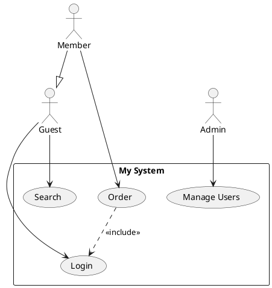
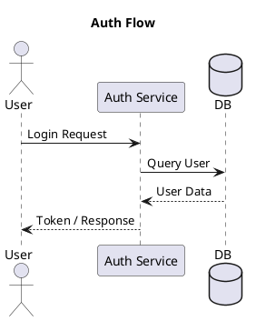

[](https://smithery.ai/server/@staruml/staruml-mcp-server)

# StarUML MCP Server

🌍 **Language:** [English](README.md) | [Tiếng Việt](README-VN.md)

[StarUML](https://staruml.io) is a sophisticated modeler for agile and concise modeling. **StarUML MCP Server** enables you to create diagrams or generate codes from diagrams in StarUML via prompts.

## Setup

Prerequisite:

- [StarUML](https://staruml.io/) `v7.0.0` or higher
- [Node.js](https://nodejs.org/) `v22` or higher

Set up `claude_desktop_config.json` in Claude Desktop as follows:

```json
{
  "mcpServers": {
    "staruml-mcp-server": {
      "command": "npx",
      "args": ["-y", "staruml-mcp-server"]
    }
  }
}
```

You can use the `--api-port=<port>` option to change the API server port for StarUML.

## Example Prompts

- _"Create a class diagram for book store in StarUML"_
- _"Create a sequence diagram for OAuth authentication in StarUML"_
- _"Generate SQL DDL from the current ERD diagram in StarUML"_

## Tools

- `generate_diagram`
- `get_current_diagram_info`
- `get_all_diagrams_info`
- `get_diagram_image_by_id`

## Dev

1. Clone this repository.
2. Build with `npm run build`.
3. Update `claude_desktop_config.json` in Claude Desktop as below.
4. Restart Claude Desktop.

```json
{
  "mcpServers": {
    "staruml-mcp-server": {
      "command": "node",
      "args": ["<full-path-to>/staruml-mcp-server/build/index.js"]
    }
  }
}
```

## PlantUML Diagram Importer (Extension)

This repository also includes a **StarUML extension** that imports various diagram types from PlantUML syntax and auto-generates them as native UML elements inside StarUML.

### 📊 Supported & Planned Diagrams

| Diagram Type | Status | Notes |
|:---|:---|:---|
| **Use Case Diagram** | ✅ Supported | Column layout, system boundary |
| **Class Diagram** | ✅ Supported | Grid layout, full attributes/methods & associations |
| **Sequence Diagram** | ✅ Supported | Chronological layout, message types, actor icons |
| **Flowchart** | ⏳ Planned | Planned for future update |
| **ER Diagram** | ⏳ Planned | Planned for future update |
| **Mindmap** | ⏳ Planned | Planned for future update |
| **Requirement Diagram** | ⏳ Planned | Planned for future update |
| **State Diagram** | ⏳ Planned | Planned for future update |

### ✨ Features

- Parse PlantUML Use Case, Class, and Sequence Diagram syntax
- Smart Grid layout for Class Diagrams, column distribution for Use Cases, and chronological vertical timeline layout for Sequence Diagrams
- Support for attributes, operations, visibilities, and multiplicities (Class Diagram)
- Support for `<<include>>`, `<<extend>>`, generalization, interface realization, associations, aggregations, and compositions
- Support for lifelines (`actor`, `participant`, `boundary`, `control`, `entity`, `database`, `collections`) and message lines (`->`, `-->`, `->>`, `->*`, `->x`) in Sequence Diagrams
- Compatible with **StarUML v7+**

### 📦 Installation

#### Quick Install
- **Windows:** Double-click `staruml-plantuml-importer\install.bat`
- **macOS / Linux:** Run `chmod +x staruml-plantuml-importer/install.sh && ./staruml-plantuml-importer/install.sh`

#### Manual Installation
Copy the entire `staruml-plantuml-importer` folder to:

| OS      | Path                                                                   |
|---------|------------------------------------------------------------------------|
| Windows | `%APPDATA%\StarUML\extensions\user\staruml-plantuml-importer`           |
| macOS   | `~/Library/Application Support/StarUML/extensions/user/staruml-plantuml-importer` |
| Linux   | `~/.config/StarUML/extensions/user/staruml-plantuml-importer`           |

Then restart StarUML.

### 🚀 How to Use

1. Open StarUML
2. Create a Diagram:
   - For Use Case: `Model` → `Add Diagram` → `Use Case Diagram`
   - For Class: `Model` → `Add Diagram` → `Class Diagram`
   - For Sequence: `Model` → `Add Diagram` → `Sequence Diagram`
3. Go to `Tools` → `PlantUML Importer` → Select your import command
4. Paste your PlantUML code in the dialog
5. Click **OK** — the diagram will be generated automatically!

### 📝 Supported PlantUML Syntax

#### Use Case Diagram Example



#### Sequence Diagram Example



#### Supported Elements

##### Use Case & Class Diagram Elements
| Element           | Syntax                                    |
|-------------------|-------------------------------------------|
| Actor             | `actor "Name" as Alias`                   |
| Use Case          | `usecase "Name" as Alias`                 |
| Association       | `Actor --> UseCase`                       |
| Include           | `UC1 ..> UC2 : <<include>>`               |
| Extend            | `UC1 ..> UC2 : <<extend>>`                |
| Generalization    | `Child --|> Parent`                       |

##### Sequence Diagram Elements
| Element           | Syntax / Type                              | Description                               |
|-------------------|--------------------------------------------|-------------------------------------------|
| Actor             | `actor ActorName`                          | Lifeline displayed as a stickman          |
| Participant       | `participant PartName`                     | Lifeline displayed as a rectangle         |
| Database          | `database DBName`                          | Lifeline representing a database          |
| Sync Call         | `A -> B : Message`                         | Solid line with solid arrowhead           |
| Async Call        | `A ->> B : Message`                        | Solid line with open arrowhead            |
| Reply Message     | `A --> B : Message`                        | Dashed line with open arrowhead           |
| Create            | `A ->* B : Message`                        | Create new lifeline/instance              |
| Delete            | `A ->x B : Message`                        | Delete/destroy lifeline/instance          |
