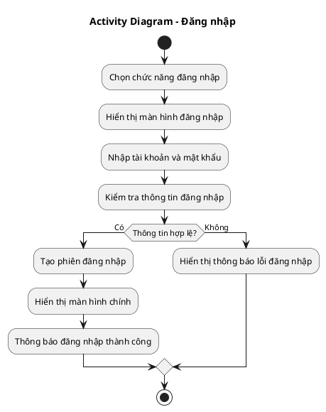
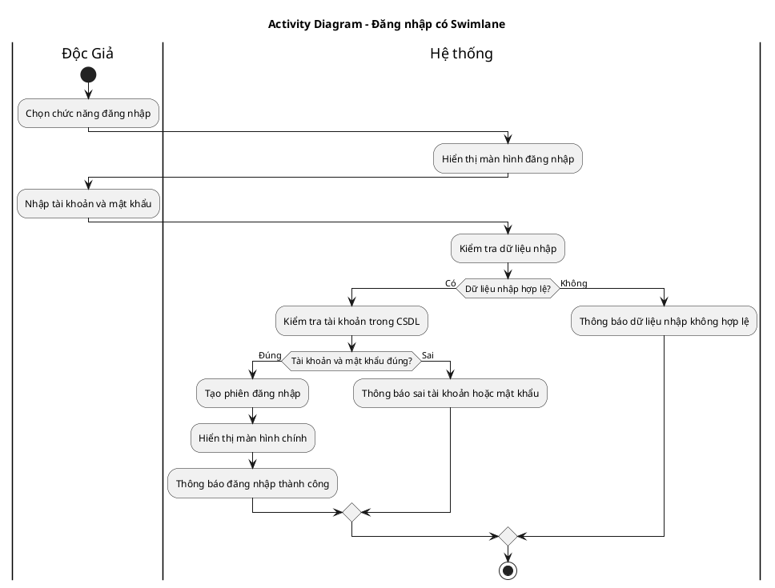
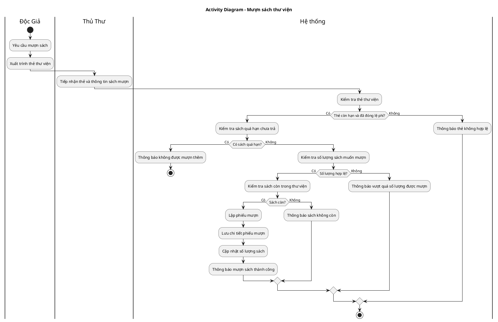
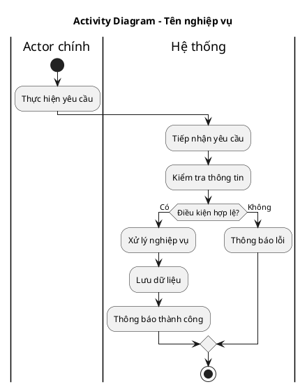

Dưới đây là **tài liệu hướng dẫn chung cho việc vẽ Activity Diagram** trong môn Phân tích thiết kế hệ thống hướng đối tượng.

---

# TÀI LIỆU HƯỚNG DẪN VẼ ACTIVITY DIAGRAM

## 1. Activity Diagram là gì?

**Activity Diagram** là sơ đồ dùng để mô tả **luồng xử lý của một nghiệp vụ** trong hệ thống.

Nói dễ hiểu:

> Activity Diagram cho biết một công việc bắt đầu từ đâu, trải qua những bước xử lý nào, có điều kiện rẽ nhánh gì, dữ liệu được lưu ở đâu và kết thúc như thế nào.

Activity Diagram thường dùng để mô tả các nghiệp vụ như:

* Đăng nhập
* Mượn sách
* Trả sách
* Cấp thẻ thư viện
* Lập phiếu mượn
* Lập phiếu phạt
* Thanh toán đơn hàng
* Quản lý thông tin sách

---

# 2. Ý nghĩa của Activity Diagram

Activity Diagram giúp người xem hiểu được **quy trình nghiệp vụ**.

Ví dụ với nghiệp vụ **Đăng nhập**, sơ đồ cần thể hiện được:

1. Người dùng chọn chức năng đăng nhập.
2. Hệ thống hiển thị màn hình đăng nhập.
3. Người dùng nhập tài khoản và mật khẩu.
4. Hệ thống kiểm tra thông tin.
5. Nếu sai thì thông báo lỗi.
6. Nếu đúng thì cho đăng nhập thành công.
7. Kết thúc nghiệp vụ.

Khác với Sequence Diagram, Activity Diagram **không tập trung vào ai gọi ai**, mà tập trung vào:

> Bước 1 làm gì, bước 2 làm gì, điều kiện nào xảy ra, kết quả cuối cùng là gì.

---

# 3. Các thành phần chính trong Activity Diagram

| Thành phần        | Ý nghĩa                                       |
| ----------------- | --------------------------------------------- |
| Start             | Điểm bắt đầu của quy trình                    |
| Activity / Action | Một hành động hoặc bước xử lý                 |
| Decision          | Điểm rẽ nhánh điều kiện                       |
| Merge             | Điểm gộp các nhánh lại                        |
| Fork              | Tách thành nhiều luồng xử lý song song        |
| Join              | Gộp các luồng song song                       |
| Swimlane          | Phân chia trách nhiệm theo actor hoặc bộ phận |
| End               | Điểm kết thúc quy trình                       |

---

# 4. Ký hiệu thường dùng

## 4.1. Start - Điểm bắt đầu

Trong PlantUML:

```plantuml
start
```

Ý nghĩa:

> Quy trình nghiệp vụ bắt đầu tại đây.

Ví dụ:

```plantuml
start
:Độc giả chọn chức năng đăng nhập;
```

---

## 4.2. Activity / Action - Hành động xử lý

Trong PlantUML:

```plantuml
:Nhập thông tin đăng nhập;
```

Ý nghĩa:

> Đây là một bước xử lý trong quy trình.

Ví dụ:

```plantuml
:Hiển thị màn hình đăng nhập;
:Nhập tài khoản và mật khẩu;
:Kiểm tra thông tin đăng nhập;
```

Tên action nên dùng dạng **động từ + đối tượng**, ví dụ:

| Nên đặt tên              | Không nên đặt tên   |
| ------------------------ | ------------------- |
| Nhập thông tin đăng nhập | Thông tin đăng nhập |
| Kiểm tra tài khoản       | Tài khoản           |
| Lập phiếu mượn           | Phiếu mượn          |
| Lưu phiếu phạt           | Phiếu phạt          |

---

## 4.3. Decision - Rẽ nhánh điều kiện

Decision dùng khi quy trình có điều kiện đúng/sai.

Trong PlantUML:

```plantuml
if (Thông tin hợp lệ?) then (Có)
    :Cho phép đăng nhập;
else (Không)
    :Thông báo lỗi;
endif
```

Ý nghĩa:

> Hệ thống kiểm tra một điều kiện, sau đó đi theo nhánh phù hợp.

Ví dụ trong đăng nhập:

```plantuml
if (Tài khoản và mật khẩu đúng?) then (Đúng)
    :Đăng nhập thành công;
else (Sai)
    :Hiển thị thông báo lỗi;
endif
```

---

## 4.4. Loop - Lặp lại hành động

Loop dùng khi một hành động có thể được thực hiện nhiều lần.

Ví dụ: người dùng nhập sai mật khẩu thì nhập lại.

```plantuml
while (Muốn tiếp tục đăng nhập?) is (Có)
    :Nhập tài khoản và mật khẩu;
    :Kiểm tra thông tin;
endwhile (Không)
```

Tuy nhiên, với bài sinh viên, có thể dùng cách đơn giản bằng `if` rồi quay lại bước nhập.

---

## 4.5. Swimlane - Phân chia trách nhiệm

Swimlane dùng để chỉ rõ **ai thực hiện hành động nào**.

Ví dụ:

```plantuml
|Độc Giả|
:Chọn chức năng đăng nhập;

|Hệ thống|
:Hiển thị màn hình đăng nhập;
```

Ý nghĩa:

* Hành động trong lane `Độc Giả` là do Độc Giả thực hiện.
* Hành động trong lane `Hệ thống` là do hệ thống xử lý.

Swimlane rất nên dùng khi nghiệp vụ có nhiều bên tham gia, ví dụ:

* Độc giả
* Thủ thư
* Nhân viên
* Hệ thống
* CSDL

---

## 4.6. End - Điểm kết thúc

Trong PlantUML:

```plantuml
stop
```

Ý nghĩa:

> Quy trình nghiệp vụ kết thúc tại đây.

---

# 5. Khi nào nên vẽ Activity Diagram?

Nên vẽ Activity Diagram khi cần mô tả:

* Quy trình nghiệp vụ.
* Các bước xử lý.
* Các điều kiện kiểm tra.
* Luồng thành công và thất bại.
* Ai thực hiện từng bước.
* Dữ liệu được tạo mới, cập nhật hoặc lưu trữ ở đâu.

Ví dụ trong hệ thống thư viện:

| Nghiệp vụ        | Có nên vẽ Activity Diagram không? | Lý do                                                |
| ---------------- | --------------------------------- | ---------------------------------------------------- |
| Đăng nhập        | Có                                | Có nhập thông tin, kiểm tra, thông báo kết quả       |
| Mượn sách        | Có                                | Có kiểm tra thẻ, kiểm tra sách, lập phiếu mượn       |
| Trả sách         | Có                                | Có kiểm tra hạn trả, tình trạng sách, lập phiếu phạt |
| Cấp thẻ thư viện | Có                                | Có kiểm tra thông tin, thu lệ phí, cấp thẻ           |
| Quản lý sách     | Có                                | Có thêm, sửa, xóa, tra cứu sách                      |

---

# 6. Quy trình vẽ Activity Diagram

## Bước 1: Chọn một nghiệp vụ cụ thể

Không nên vẽ Activity Diagram cho toàn bộ hệ thống cùng lúc.

Ví dụ chọn nghiệp vụ:

```text
Đăng nhập
```

hoặc:

```text
Mượn sách
```

---

## Bước 2: Xác định actor tham gia

Ví dụ với nghiệp vụ đăng nhập:

```text
Actor: Độc Giả
```

Ví dụ với nghiệp vụ mượn sách:

```text
Actor: Độc Giả, Thủ thư, Hệ thống
```

---

## Bước 3: Xác định điểm bắt đầu

Cần trả lời câu hỏi:

> Nghiệp vụ bắt đầu khi nào?

Ví dụ:

| Nghiệp vụ | Điểm bắt đầu                        |
| --------- | ----------------------------------- |
| Đăng nhập | Người dùng chọn chức năng đăng nhập |
| Mượn sách | Độc giả yêu cầu mượn sách           |
| Trả sách  | Độc giả mang sách đến trả           |
| Cấp thẻ   | Độc giả yêu cầu cấp thẻ thư viện    |

---

## Bước 4: Liệt kê các bước xử lý chính

Ví dụ nghiệp vụ đăng nhập:

```text
1. Chọn chức năng đăng nhập
2. Hiển thị màn hình đăng nhập
3. Nhập tài khoản và mật khẩu
4. Kiểm tra dữ liệu nhập
5. Kiểm tra tài khoản trong CSDL
6. Thông báo kết quả
```

---

## Bước 5: Xác định điều kiện rẽ nhánh

Cần tìm các câu hỏi dạng:

* Có hợp lệ không?
* Có tồn tại không?
* Có đủ điều kiện không?
* Có quá hạn không?
* Có còn sách không?
* Có bị phạt không?

Ví dụ đăng nhập:

```text
Tài khoản và mật khẩu có đúng không?
```

Ví dụ mượn sách:

```text
Thẻ thư viện còn hạn không?
Độc giả còn sách quá hạn không?
Sách còn số lượng không?
Số lượng mượn có vượt quy định không?
```

---

## Bước 6: Xác định dữ liệu được lưu

Một Activity Diagram tốt không chỉ mô tả hành động, mà còn chỉ rõ dữ liệu nào được lưu hoặc cập nhật.

Ví dụ với mượn sách:

```text
Lưu phiếu mượn
Lưu chi tiết phiếu mượn
Cập nhật số lượng sách hiện có
```

Ví dụ với đăng nhập:

```text
Tạo phiên đăng nhập
Lưu thời gian đăng nhập, nếu hệ thống yêu cầu
```

---

## Bước 7: Xác định điểm kết thúc

Cần trả lời câu hỏi:

> Quy trình kết thúc khi nào?

Ví dụ:

| Nghiệp vụ | Điểm kết thúc                                         |
| --------- | ----------------------------------------------------- |
| Đăng nhập | Hiển thị màn hình chính hoặc thông báo lỗi            |
| Mượn sách | Phiếu mượn được lập thành công                        |
| Trả sách  | Sách được ghi nhận đã trả, phiếu phạt được lập nếu có |
| Cấp thẻ   | Thẻ thư viện được cấp hoặc yêu cầu bị từ chối         |

---

# 7. Mẫu Activity Diagram không có swimlane

Dùng khi quy trình đơn giản, chỉ cần mô tả các bước xử lý.



---

# 8. Mẫu Activity Diagram có swimlane

Dùng khi muốn thể hiện rõ trách nhiệm của từng bên.



---

# 9. Cách xác định Activity Diagram từ Sequence Diagram

Từ Sequence Diagram, có thể chuyển sang Activity Diagram bằng cách lấy các message chính và biến thành các hành động xử lý.

Ví dụ Sequence Diagram đăng nhập có các message:

```text
Chọn chức năng đăng nhập
Mở màn hình đăng nhập
Nhập thông tin người dùng
Kiểm tra thông tin
Kiểm tra dữ liệu người dùng
Trả kết quả kiểm tra
Thông báo lỗi hoặc thành công
```

Chuyển sang Activity Diagram:

```text
Bắt đầu
Chọn chức năng đăng nhập
Hiển thị màn hình đăng nhập
Nhập tài khoản và mật khẩu
Kiểm tra thông tin
Thông tin đúng?
    Có → Hiển thị màn hình chính
    Không → Hiển thị thông báo lỗi
Kết thúc
```

---

# 10. So sánh Activity Diagram và Sequence Diagram

| Tiêu chí         | Activity Diagram              | Sequence Diagram                              |
| ---------------- | ----------------------------- | --------------------------------------------- |
| Mục đích         | Mô tả luồng công việc         | Mô tả tương tác giữa các đối tượng            |
| Tập trung vào    | Các bước xử lý                | Ai gọi ai, gửi gì, trả gì                     |
| Thứ tự           | Theo luồng hành động          | Theo thời gian từ trên xuống                  |
| Thành phần chính | Action, Decision, Swimlane    | Actor, Participant, Message, Activation bar   |
| Dùng khi         | Phân tích quy trình nghiệp vụ | Thiết kế chi tiết cách các đối tượng phối hợp |

Hiểu đơn giản:

```text
Activity Diagram: Làm những bước nào?
Sequence Diagram: Ai gọi ai để làm những bước đó?
```

---

# 11. Ví dụ Activity Diagram cho nghiệp vụ mượn sách



---

# 12. Checklist kiểm tra Activity Diagram

Sau khi vẽ xong, nên kiểm tra các câu hỏi sau:

| Câu hỏi kiểm tra                                              | Đạt chưa? |
| ------------------------------------------------------------- | --------- |
| Sơ đồ có điểm bắt đầu `start` không?                          |           |
| Sơ đồ có điểm kết thúc `stop` không?                          |           |
| Mỗi hành động có dùng động từ rõ ràng không?                  |           |
| Có thể hiện actor hoặc bộ phận thực hiện bằng swimlane không? |           |
| Các bước có đúng thứ tự nghiệp vụ không?                      |           |
| Có điều kiện rẽ nhánh quan trọng không?                       |           |
| Các nhánh Có / Không có rõ ràng không?                        |           |
| Có xử lý trường hợp thất bại không?                           |           |
| Có xử lý trường hợp thành công không?                         |           |
| Có bước lưu dữ liệu hoặc cập nhật dữ liệu nếu cần không?      |           |
| Sơ đồ có quá rối không?                                       |           |

---

# 13. Lỗi thường gặp khi vẽ Activity Diagram

## Lỗi 1: Không có điểm bắt đầu hoặc kết thúc

Sai:

```plantuml
:Nhập thông tin;
:Kiểm tra thông tin;
```

Đúng:

```plantuml
start
:Nhập thông tin;
:Kiểm tra thông tin;
stop
```

---

## Lỗi 2: Đặt tên hành động bằng danh từ

Sai:

```text
Tài khoản
Phiếu mượn
Thông tin sách
```

Đúng:

```text
Nhập tài khoản
Lập phiếu mượn
Kiểm tra thông tin sách
```

---

## Lỗi 3: Thiếu nhánh thất bại

Sai:

```plantuml
if (Thông tin hợp lệ?) then (Có)
    :Lưu thông tin;
endif
```

Đúng:

```plantuml
if (Thông tin hợp lệ?) then (Có)
    :Lưu thông tin;
else (Không)
    :Thông báo lỗi;
endif
```

---

## Lỗi 4: Không ghi rõ dữ liệu được lưu

Ví dụ với mượn sách, không nên chỉ ghi:

```text
Xử lý mượn sách
```

Nên ghi rõ:

```text
Lập phiếu mượn
Lưu chi tiết phiếu mượn
Cập nhật số lượng sách hiện có
```

---

## Lỗi 5: Nhầm Activity Diagram với Sequence Diagram

Activity Diagram không cần thể hiện chi tiết:

```text
Màn hình A gọi Controller B
Controller B gọi CSDL
CSDL trả kết quả
```

Đó là nội dung của Sequence Diagram.

Activity Diagram chỉ cần thể hiện:

```text
Nhập thông tin
Kiểm tra thông tin
Lưu dữ liệu
Thông báo kết quả
```

---

# 14. Mẫu khung PlantUML dùng chung

Có thể dùng mẫu sau cho nhiều nghiệp vụ:



---

# 15. Kết luận

Khi vẽ Activity Diagram, cần tập trung vào:

```text
Nghiệp vụ bắt đầu khi nào?
Ai thực hiện từng bước?
Hệ thống kiểm tra điều kiện gì?
Nếu đúng thì làm gì?
Nếu sai thì làm gì?
Dữ liệu nào được lưu hoặc cập nhật?
Kết quả cuối cùng là gì?
```

Activity Diagram là sơ đồ phù hợp để mô tả **quy trình nghiệp vụ**, giúp người xem hiểu rõ hệ thống xử lý từng bước như thế nào trước khi chuyển sang thiết kế chi tiết bằng Sequence Diagram hoặc Class Diagram.
