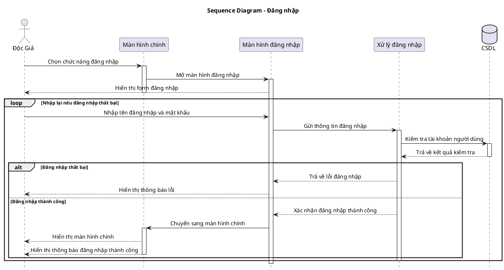

Dưới đây là **tài liệu hướng dẫn chung để vẽ Sequence Diagram**, dựa theo mẫu sơ đồ đăng nhập bạn đã làm.

---

# TÀI LIỆU HƯỚNG DẪN VẼ SEQUENCE DIAGRAM

## 1. Sequence Diagram là gì?

**Sequence Diagram** là sơ đồ dùng để mô tả **trình tự tương tác giữa các đối tượng trong hệ thống theo thời gian**.

Sequence Diagram thường dùng để mô tả chi tiết **một nghiệp vụ cụ thể**, ví dụ:

* Đăng nhập
* Mượn sách
* Trả sách
* Cấp thẻ thư viện
* Thanh toán đơn hàng
* Lập hóa đơn

Khi vẽ Sequence Diagram, cần xác định rõ:

> Ai gọi ai, gọi lúc nào, gửi thông tin gì, hệ thống xử lý ra sao và trả kết quả như thế nào.

---

# 2. Ý nghĩa của Sequence Diagram

Sequence Diagram giúp người phân tích hiểu được:

* Actor nào bắt đầu nghiệp vụ.
* Màn hình nào tiếp nhận yêu cầu.
* Bộ xử lý nào xử lý nghiệp vụ.
* CSDL nào được truy vấn hoặc cập nhật.
* Kết quả được trả về cho ai.
* Trường hợp thành công và thất bại diễn ra như thế nào.

Ví dụ với nghiệp vụ **Đăng nhập**, sơ đồ cần thể hiện được:

1. Độc giả chọn chức năng đăng nhập.
2. Hệ thống mở màn hình đăng nhập.
3. Độc giả nhập thông tin đăng nhập.
4. Hệ thống kiểm tra thông tin.
5. Hệ thống truy vấn CSDL.
6. Nếu sai thì thông báo lỗi.
7. Nếu đúng thì chuyển vào màn hình chính.

---

# 3. Các thành phần chính trong Sequence Diagram

| Thành phần           | Ý nghĩa                                                                  |
| -------------------- | ------------------------------------------------------------------------ |
| Actor                | Người hoặc hệ thống bên ngoài tương tác với hệ thống                     |
| Participant / Object | Các đối tượng tham gia xử lý như màn hình, controller, service, database |
| Lifeline             | Đường dọc thể hiện sự tồn tại của actor/object theo thời gian            |
| Message              | Mũi tên thể hiện lời gọi, yêu cầu hoặc dữ liệu gửi đi                    |
| Activation bar       | Ô chữ nhật nhỏ thể hiện đối tượng đang xử lý                             |
| alt                  | Rẽ nhánh điều kiện, ví dụ thành công/thất bại                            |
| loop                 | Lặp lại một hành động                                                    |
| database             | Cơ sở dữ liệu của hệ thống                                               |

---

# 4. Cách xác định Actor

Actor là người hoặc hệ thống bên ngoài **tương tác trực tiếp** với chức năng đang xét.

Ví dụ trong nghiệp vụ đăng nhập:

```text
Actor: Độc Giả
```

Vì Độc Giả là người trực tiếp chọn đăng nhập và nhập thông tin đăng nhập.

Một số actor thường gặp:

| Nghiệp vụ        | Actor                          |
| ---------------- | ------------------------------ |
| Đăng nhập        | Người dùng, Độc giả, Nhân viên |
| Mượn sách        | Độc giả, Thủ thư               |
| Trả sách         | Độc giả, Thủ thư               |
| Cấp thẻ thư viện | Độc giả, Nhân viên             |
| Quản lý sách     | Nhân viên quản lý sách         |

Lưu ý:
Không nên thêm actor nếu nghiệp vụ không nhắc đến hoặc không có căn cứ rõ ràng.

---

# 5. Cách xác định Participant / Object

Participant là các đối tượng bên trong hệ thống tham gia xử lý nghiệp vụ.

Thông thường, một Sequence Diagram có thể gồm các nhóm đối tượng sau:

| Loại đối tượng | Ví dụ                              |
| -------------- | ---------------------------------- |
| Giao diện      | Màn hình chính, Màn hình đăng nhập |
| Bộ xử lý       | Xử lý đăng nhập, LoginController   |
| CSDL           | CSDL, Database                     |
| Hệ thống ngoài | Cổng thanh toán, Email Server      |

Với nghiệp vụ đăng nhập, có thể xác định các participant như sau:

```text
Độc Giả
Màn hình chính
Màn hình đăng nhập
Xử lý đăng nhập
CSDL
```

Ý nghĩa:

| Đối tượng          | Vai trò                               |
| ------------------ | ------------------------------------- |
| Độc Giả            | Người thực hiện đăng nhập             |
| Màn hình chính     | Nơi chọn chức năng đăng nhập          |
| Màn hình đăng nhập | Nơi nhập tài khoản và mật khẩu        |
| Xử lý đăng nhập    | Kiểm tra logic đăng nhập              |
| CSDL               | Lưu và truy xuất thông tin người dùng |

---

# 6. Cách xác định Message

**Message** là các mũi tên trong Sequence Diagram.

Message dùng để thể hiện:

* Actor gửi yêu cầu cho giao diện.
* Giao diện gửi dữ liệu cho bộ xử lý.
* Bộ xử lý truy vấn CSDL.
* CSDL trả kết quả.
* Hệ thống thông báo kết quả cho actor.

Ví dụ:

```plantuml
DocGia -> MainUI : Chọn chức năng đăng nhập
MainUI -> LoginUI : Mở màn hình đăng nhập
DocGia -> LoginUI : Nhập tên đăng nhập và mật khẩu
LoginUI -> XuLy : Gửi thông tin đăng nhập
XuLy -> CSDL : Kiểm tra tài khoản
CSDL --> XuLy : Trả kết quả kiểm tra
```

Trong đó:

| Ký hiệu | Ý nghĩa                 |
| ------- | ----------------------- |
| `->`    | Gửi yêu cầu / gọi xử lý |
| `-->`   | Trả kết quả / phản hồi  |

---

# 7. Activation Bar là gì?

**Activation bar** là các ô chữ nhật nhỏ nằm trên lifeline của actor hoặc object.

Nó còn được gọi là:

* Thanh kích hoạt
* Thanh thực thi
* Thời gian xử lý
* Execution time

Activation bar thể hiện rằng:

> Đối tượng đang được kích hoạt để xử lý một hành động nào đó.

Ví dụ:

```plantuml
DocGia -> LoginUI : Nhập thông tin đăng nhập
activate LoginUI

LoginUI -> XuLy : Gửi thông tin đăng nhập
activate XuLy

XuLy --> LoginUI : Trả kết quả kiểm tra
deactivate XuLy

LoginUI --> DocGia : Hiển thị thông báo
deactivate LoginUI
```

Ý nghĩa:

1. `LoginUI` nhận thông tin từ Độc Giả nên bắt đầu xử lý.
2. `LoginUI` gọi `XuLy`.
3. `XuLy` xử lý kiểm tra đăng nhập.
4. `XuLy` trả kết quả rồi kết thúc xử lý.
5. `LoginUI` hiển thị kết quả rồi kết thúc xử lý.

---

# 8. Cách xác định Activation Bar

Khi vẽ Sequence Diagram, có thể xác định activation bar theo nguyên tắc sau:

## Khi nào bắt đầu `activate`?

Dùng `activate` khi một đối tượng **nhận được yêu cầu và bắt đầu xử lý**.

Ví dụ:

```plantuml
DocGia -> MainUI : Chọn chức năng đăng nhập
activate MainUI
```

Có nghĩa là `MainUI` bắt đầu xử lý yêu cầu chọn đăng nhập.

---

## Khi nào dùng `deactivate`?

Dùng `deactivate` khi đối tượng **xử lý xong và trả kết quả**.

Ví dụ:

```plantuml
MainUI -> LoginUI : Mở màn hình đăng nhập
activate LoginUI

LoginUI --> DocGia : Hiển thị form đăng nhập
deactivate LoginUI
```

Có nghĩa là `LoginUI` xử lý xong việc hiển thị form đăng nhập.

---

## Quy tắc dễ nhớ

```text
Nhận yêu cầu  → activate
Xử lý xong   → deactivate
```

Ví dụ:

```plantuml
A -> B : Gửi yêu cầu
activate B

B --> A : Trả kết quả
deactivate B
```

---

# 9. Cách dùng `alt` trong Sequence Diagram

`alt` dùng để mô tả các trường hợp rẽ nhánh.

Ví dụ trong đăng nhập:

```plantuml
alt Đăng nhập thất bại
    XuLy --> LoginUI : Thông báo lỗi
    LoginUI --> DocGia : Hiển thị thông báo lỗi

else Đăng nhập thành công
    XuLy --> LoginUI : Xác nhận thành công
    LoginUI --> MainUI : Chuyển về màn hình chính
end
```

Ý nghĩa:

* Nếu đăng nhập thất bại thì thông báo lỗi.
* Nếu đăng nhập thành công thì chuyển vào hệ thống.

---

# 10. Cách dùng `loop` trong Sequence Diagram

`loop` dùng khi một hành động có thể lặp lại.

Ví dụ trong đăng nhập:

```plantuml
loop Nhập lại nếu đăng nhập thất bại
    DocGia -> LoginUI : Nhập tài khoản và mật khẩu
    LoginUI -> XuLy : Gửi thông tin đăng nhập
end
```

Ý nghĩa:

> Người dùng có thể nhập lại thông tin nếu đăng nhập thất bại.

Lưu ý:
Không nên đặt `loop` bao trùm toàn bộ sơ đồ nếu chỉ có một phần nghiệp vụ lặp lại. Với đăng nhập, phần lặp thường là **nhập thông tin và kiểm tra lại**, không phải mở màn hình đăng nhập nhiều lần.

---

# 11. Quy trình vẽ Sequence Diagram

Khi vẽ một Sequence Diagram, có thể làm theo các bước sau:

## Bước 1: Chọn một nghiệp vụ cụ thể

Ví dụ:

```text
Đăng nhập
```

Không nên vẽ Sequence Diagram cho cả hệ thống quá lớn.

---

## Bước 2: Xác định actor

Ví dụ:

```text
Độc Giả
```

---

## Bước 3: Xác định các đối tượng tham gia

Ví dụ:

```text
Màn hình chính
Màn hình đăng nhập
Xử lý đăng nhập
CSDL
```

---

## Bước 4: Xác định luồng chính

Ví dụ:

```text
Độc Giả chọn đăng nhập
Hệ thống mở màn hình đăng nhập
Độc Giả nhập thông tin
Hệ thống kiểm tra thông tin
CSDL trả kết quả
Hệ thống thông báo kết quả
```

---

## Bước 5: Xác định các điều kiện rẽ nhánh

Ví dụ:

```text
Nếu sai tài khoản hoặc mật khẩu → thông báo lỗi
Nếu đúng tài khoản và mật khẩu → đăng nhập thành công
```

---

## Bước 6: Xác định activation bar

Dựa vào nguyên tắc:

```text
Đối tượng nhận yêu cầu thì activate
Đối tượng xử lý xong thì deactivate
```

---

# 12. Mẫu Sequence Diagram đăng nhập hoàn chỉnh



---

# 13. Checklist kiểm tra Sequence Diagram

Sau khi vẽ xong, nên kiểm tra các câu hỏi sau:

| Câu hỏi kiểm tra                                       | Đạt chưa? |
| ------------------------------------------------------ | --------- |
| Sơ đồ có đúng là một nghiệp vụ cụ thể không?           |           |
| Có actor bắt đầu nghiệp vụ không?                      |           |
| Có giao diện tiếp nhận yêu cầu không?                  |           |
| Có bộ xử lý nghiệp vụ không?                           |           |
| Có CSDL nếu cần kiểm tra/lưu dữ liệu không?            |           |
| Các message có đúng thứ tự từ trên xuống dưới không?   |           |
| Có thể hiện ai gọi ai không?                           |           |
| Có thể hiện dữ liệu được gửi đi không?                 |           |
| Có kết quả trả về không?                               |           |
| Có nhánh thành công/thất bại nếu cần không?            |           |
| Activation bar có bắt đầu và kết thúc hợp lý không?    |           |
| Tên message có rõ ràng, không viết tắt khó hiểu không? |           |

---

# 14. Một số lỗi thường gặp khi vẽ Sequence Diagram

## Lỗi 1: Nhầm Sequence Diagram với Activity Diagram

Sequence Diagram mô tả:

```text
Ai gọi ai, gửi gì, trả gì
```

Activity Diagram mô tả:

```text
Các bước nghiệp vụ diễn ra như thế nào
```

---

## Lỗi 2: Thiếu bộ xử lý

Ví dụ sai:

```text
Màn hình đăng nhập → CSDL
```

Nên có lớp xử lý ở giữa:

```text
Màn hình đăng nhập → Xử lý đăng nhập → CSDL
```

Vì giao diện không nên trực tiếp xử lý toàn bộ nghiệp vụ.

---

## Lỗi 3: Thiếu kết quả trả về

Nếu có message gửi đi thì thường nên có message phản hồi.

Ví dụ:

```plantuml
XuLy -> CSDL : Kiểm tra tài khoản
CSDL --> XuLy : Trả kết quả kiểm tra
```

---

## Lỗi 4: Activation bar không cân đối

Ví dụ sai:

```plantuml
activate XuLy
```

nhưng không có:

```plantuml
deactivate XuLy
```

Nên đảm bảo mỗi `activate` có một `deactivate` phù hợp.

---

## Lỗi 5: Tên message viết quá chung chung

Không nên viết:

```text
Xử lý
Kiểm tra
Thông báo
```

Nên viết rõ:

```text
Gửi thông tin đăng nhập
Kiểm tra tài khoản người dùng
Trả về lỗi đăng nhập
Hiển thị thông báo đăng nhập thành công
```

---

# 15. Kết luận

Sequence Diagram là sơ đồ rất quan trọng trong phân tích thiết kế hướng đối tượng. Khi vẽ sơ đồ này, cần tập trung vào việc xác định:

```text
Ai tham gia?
Ai gọi ai?
Gửi thông tin gì?
Xử lý ở đâu?
Trả kết quả như thế nào?
Có nhánh thành công/thất bại không?
Đối tượng nào đang xử lý tại thời điểm nào?
```

Trong đó, **activation bar** là phần giúp sơ đồ rõ hơn vì nó cho biết đối tượng nào đang thực hiện xử lý sau khi nhận được thông điệp.
