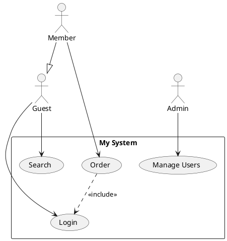

# StarUML Use Case Diagram Importer

A StarUML extension that imports **Use Case Diagrams** from **PlantUML** syntax and auto-generates them as native UML elements inside StarUML.

## ✨ Features

- Parse PlantUML Use Case syntax (actors, use cases, relationships)
- Auto-layout with smart column distribution
- Support for `<<include>>`, `<<extend>>`, and generalization relationships
- Separate primary actors (left) and secondary/system actors (right)
- Compatible with **StarUML v7+**

## 📦 Installation

### Windows

1. Download or clone this repository
2. **Double-click** `install.bat`
3. Restart StarUML

### macOS / Linux

```bash
chmod +x install.sh
./install.sh
```

### Manual Installation

Copy the entire `staruml-usecase-importer` folder to:

| OS      | Path                                                                   |
|---------|------------------------------------------------------------------------|
| Windows | `%APPDATA%\StarUML\extensions\user\staruml-usecase-importer`           |
| macOS   | `~/Library/Application Support/StarUML/extensions/user/staruml-usecase-importer` |
| Linux   | `~/.config/StarUML/extensions/user/staruml-usecase-importer`           |

Then restart StarUML.

## 🚀 How to Use

1. Open StarUML
2. Create a **Use Case Diagram**: `Model` → `Add Diagram` → `Use Case Diagram`
3. Go to `Tools` → **"Import Use Case from PlantUML..."**
4. Paste your PlantUML code in the dialog
5. Click **OK** — the diagram will be generated automatically!

## 📝 Supported PlantUML Syntax



### Supported Elements

| Element           | Syntax                                    |
|-------------------|-------------------------------------------|
| Actor             | `actor "Name" as Alias`                   |
| Use Case          | `usecase "Name" as Alias`                 |
| Association       | `Actor --> UseCase`                       |
| Include           | `UC1 ..> UC2 : <<include>>`               |
| Extend            | `UC1 ..> UC2 : <<extend>>`                |
| Generalization    | `Child --|> Parent`                       |

## 📄 License

MIT
